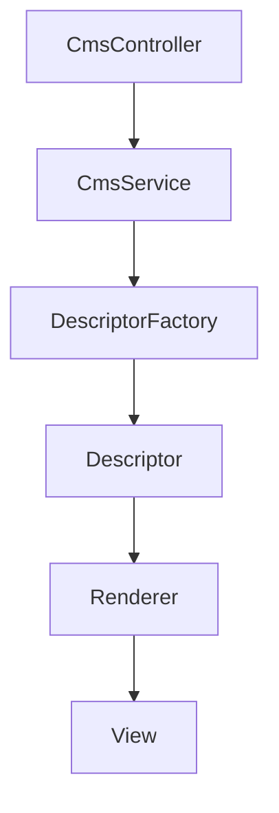
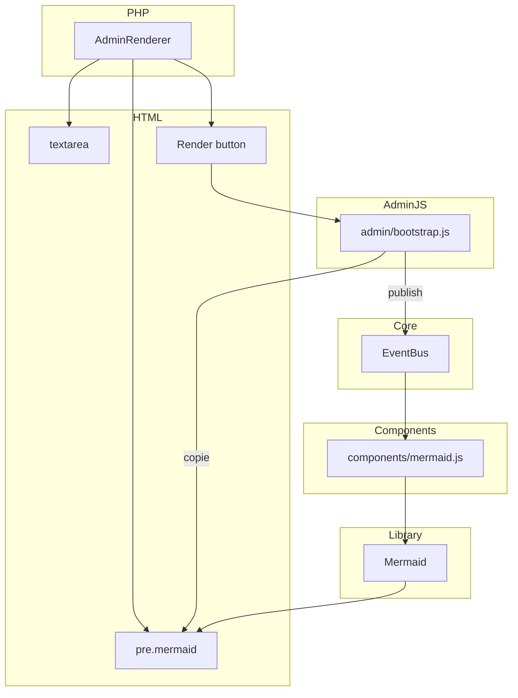

# Zealot v2 - CMS Headless

Un CMS professionnel basé sur CodeIgniter 4.7 pour gérer :
- Contenu structuré (catégories → articles → sections → parts)
- Composants JavaScript avancés (Apex, Mermaid, ThreeJS)
- API JSON et descripteurs de composants

**Statut** : Migration vers refactorisation
**Tech** : PHP 8+, CodeIgniter 4.7, MySQL 8+/MariaDB, JavaScript ES6+

