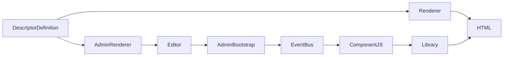

# Pattern d'intégration des composants

Tous les composants du CMS suivent ce patron standardisé :

### Flux d'intégration
1. **DescriptorDefinition** : Définit la configuration du composant
2. **Renderer** : Génère le HTML côté serveur
3. **AdminRenderer** : Génère l'interface d'édition
4. **AdminBootstrap** : Initialise les listeners JavaScript
5. **EventBus** : Orchestre la communication
6. **ComponentJS** : Logique du composant
7. **Library** : Utilise les dépendances externes
