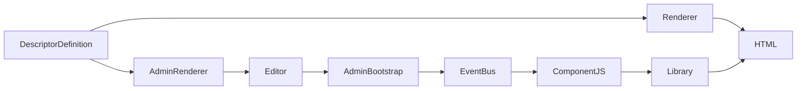

---
ApexAdminRenderer
    app\Libraries\Components\AdminRenderers\ApexAdminRenderer.php

dependances:
    app\Libraries\Components\DescriptorDefinition.php


---
ApexRenderer
    app\Libraries\Components\Renderers\ApexRenderer.php

dependances:
    app\Libraries\Components\DescriptorDefinition.php


---
ComponentRegistry
    app\Libraries\Cms\ComponentRegistry.php

dependances:
    app\Libraries\Cms\DescriptorDefinition.php


---
CalloutRenderer
    app\Libraries\Components\Renderers\CalloutRenderer
dependances:
    app\Libraries\Components\DescriptorDefinition.php

---
CodeValRenderer
    app\Libraries\Components\Renderers\CodeValRenderer.php

dependances:
    app\Libraries\Components\DescriptorDefinition.php

---
ComponentRendererInterface
    app\Libraries\Components\Renderers\ComponentRendererInterface.php
dependances:
    app\Libraries\Components\DescriptorDefinition.php

utilisé par :
    app\Libraries\Components\AdminRenderers\CalloutAdminRenderer.php
    app\Libraries\Components\AdminRenderers\CodeValAdminRenderer.php
    app\Libraries\Components\AdminRenderers\MermaidAdminRenderer.php
    app\Libraries\Components\AdminRenderers\RawAdminRenderer.php
    
    app\Libraries\Components\Renderers\ApexRenderer.php
    app\Libraries\Components\Renderers\CalloutRenderer.php
    app\Libraries\Components\Renderers\CodeValRenderer.php
    app\Libraries\Components\Renderers\LeafletRenderer.php
    app\Libraries\Components\Renderers\MermaidRenderer.php
    app\Libraries\Components\Renderers\RawRenderer.php
    app\Libraries\Components\Renderers\ThreeRenderer.php


voir non utilisé par 
    app\Libraries\Components\AdminRenderers\ApexAdminRenderer.php
    app\Libraries\Components\AdminRenderers\LeafletAdminRenderer.php
    app\Libraries\Components\AdminRenderers\ThreeAdminRenderer.php    


---
# DescriptorDefinition
[DescriptorDefinition](/documentation/ARCHITECTURE/DescriptorDefinition.md) - Obsolete à mettre a jour avec ces infos content n'existe plus et ComponentDefinition n'existe pas

Il faut aborder DescriptorDefinition sans penser à PHP.
Ce n'est pas un DTO. Ce n'est pas un modèle. Ce n'est pas un ViewModel.
```
DescriptorDefinition { type , config }
```
Le Descriptor indique tout ce qu'il faut pour créer un runtime. C'est un contrat d'exécution.

Le runtime pouvant être :
- Mermaid
- Apex
- Leaflet
- Three
- (demain un SceneWorkbench)


attention double implémentation
    app\Libraries\Cms\DescriptorDefinition.php
        namespace App\Libraries\Cms
    app\Libraries\Components\DescriptorDefinition.php
        namespace App\Libraries\Components;


dependances:

utilisé par :
    app\Controllers\TestController.php:
    
    app\Libraries\Cms\ComponentRegistry.php
    app\Libraries\Cms\DescriptorFactory.php

    app\Libraries\Components\AdminComponentRenderer.php
    app\Libraries\Components\ComponentRenderer.php

    app\Libraries\Components\AdminRenderers\ApexAdminRenderer.php
    app\Libraries\Components\AdminRenderers\CalloutAdminRenderer.php
    app\Libraries\Components\AdminRenderers\CodeValAdminRenderer.php
    app\Libraries\Components\AdminRenderers\LeafletAdminRenderer.php
    app\Libraries\Components\AdminRenderers\MermaidAdminRenderer.php
    app\Libraries\Components\AdminRenderers\RawAdminRenderer.php
    app\Libraries\Components\AdminRenderers\ThreeAdminRenderer.php
    
    app\Libraries\Components\Renderers\ApexRenderer.php
    app\Libraries\Components\Renderers\CalloutRenderer.php
    app\Libraries\Components\Renderers\CodeValRenderer.php
    app\Libraries\Components\Renderers\ComponentRendererInterface.php
    app\Libraries\Components\Renderers\LeafletRenderer.php
    app\Libraries\Components\Renderers\MermaidRenderer.php
    app\Libraries\Components\Renderers\RawRenderer.php
    app\Libraries\Components\Renderers\ThreeRenderer.php
---
DescriptorFactory
    app\Libraries\Cms\DescriptorFactory.php"

- dependances:


- utilisé par :
    app\Controllers\TestDescriptor.php

---
# DescriptorMapper

- Il fait uniquement une normalisation. Il traduit les données métier en langage interne
```
    CMS -> type_id = 7 -> threejs -> DescriptorDefinition
```
- Il ne crée aucun composant.
- Il ne fait aucune logique métier.


- fichier :
    [app\Libraries\Components\DescriptorMapper.php](/refactoring/app/Libraries/Components/DescriptorMapper.php)
    
- dependances
     [app\Libraries\Components\DescriptorDefinition.php](/refactoring/app/Libraries/Components/DescriptorDefinition.php)

- A FAIRE
    Vérifier la dépendance 
        DescriptorDefinition - app\Libraries\Components\DescriptorDefinition.php et non app\Libraries\Cms\DescriptorDefinition.php


---
LeafletRenderer
    app\Libraries\Components\Renderers\LeafletRenderer.php
dependances:
    app\Libraries\Components\DescriptorDefinition.php


---
MermaidRenderer
    app\Libraries\Components\Renderers\MermaidRenderer.php
dependances:
    app\Libraries\Components\DescriptorDefinition.php

---
RawRenderer
    app\Libraries\Components\Renderers\RawRenderer.php

- dependances:
    app\Libraries\Components\DescriptorDefinition.php

---
ThreeRenderer
    app\Libraries\Components\Renderers\ThreeRenderer.php

- dependances:
    app\Libraries\Components\DescriptorDefinition.php

---
AdminComponentRegistry
    \app\Libraries\Components\AdminComponentRegistry.php"
dependances:

utilisé par :
    app/Libraries/Components/AdminComponentRenderer.php

---
AdminComponentRenderer
\app\Libraries\Components\AdminComponentRenderer.php"
dependances:
AdminComponentRegistry - app\Libraries\Components\AdminComponentRegistry.php"
DescriptorDefinition - app\Libraries\Cms\DescriptorDefinition.php"

---

ComponentRenderer
app/Libraries/Components/ComponentRenderer.php

ComponentRendererInterface

\app\Libraries\Components\DescriptorDefinition.php"
\app\Libraries\Components\DescriptorMapper.php"


ComponentRegistry
\app\Libraries\Components\ComponentRegistry.php"


----
# OBSOLETE

## Pattern d'intégration des composants

Tous les composants du CMS suivent ce patron standardisé :


```mermaid
flowchart LR

    Descriptor["DescriptorDefinition"]

    Descriptor --> Renderer
    Descriptor --> AdminRenderer

    Renderer --> HTML

    AdminRenderer --> Editor

    Editor --> AdminBootstrap

    AdminBootstrap --> EventBus

    EventBus --> ComponentJS

    ComponentJS --> Library

    Library --> HTML
```

### Flux d'intégration
1. **DescriptorDefinition** : Définit la configuration du composant
2. **Renderer** : Génère le HTML côté serveur
3. **AdminRenderer** : Génère l'interface d'édition
4. **AdminBootstrap** : Initialise les listeners JavaScript
5. **EventBus** : Orchestre la communication
6. **ComponentJS** : Logique du composant
7. **Library** : Utilise les dépendances externes
