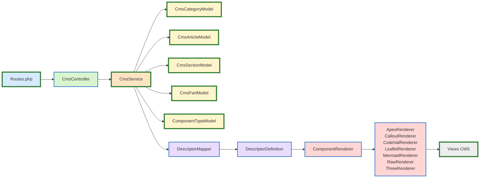
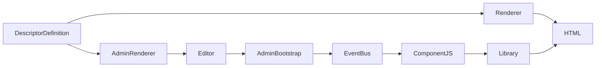

# Architecture Overview

Ce document présente l'architecture générale du CMS Zealot.

Il constitue le point d'entrée de la documentation technique et décrit les principales couches de l'application ainsi que leurs responsabilités.

Les détails d'implémentation sont documentés dans les fichiers spécialisés du dossier `ARCHITECTURE` et dans les diagrammes du dossier `FLOWS`.

---

# Principes

L'architecture du CMS repose sur une séparation claire des responsabilités :

- les **Routes** reçoivent les requêtes HTTP ;
- les **Controllers** pilotent les traitements ;
- le **CmsService** centralise la logique du CMS ;
- les **Models** accèdent aux données ;
- les **Descriptors** constituent le contrat entre le CMS et le moteur de rendu ;
- les **Renderers** produisent le HTML des composants ;
- les **Views** assemblent les pages.

Le contrôleur ne contient aucune logique métier.

Le rendu des composants est indépendant des données du CMS grâce au couple **DescriptorMapper / DescriptorDefinition**.

---

# Architecture générale


```mermaid
flowchart LR

    Routes["Routes.php"]:::routes

    CmsController["CmsController"]:::controller

    CmsService["CmsService"]:::service

    CmsCategoryModel["CmsCategoryModel"]:::model
    CmsArticleModel["CmsArticleModel"]:::model
    CmsSectionModel["CmsSectionModel"]:::model
    CmsPartModel["CmsPartModel"]:::model
    ComponentTypeModel["ComponentTypeModel"]:::model

    DescriptorMapper["DescriptorMapper"]:::descriptor
    DescriptorDefinition["DescriptorDefinition"]:::descriptor

    ComponentRenderer["ComponentRenderer"]:::renderer
    Renderers["ApexRenderer<br/>CalloutRenderer<br/>CodeValRenderer<br/>LeafletRenderer<br/>MermaidRenderer<br/>RawRenderer<br/>ThreeRenderer"]:::renderer

    Views["Views CMS"]:::view

    Routes --> CmsController

    CmsController --> CmsService

    CmsService --> CmsCategoryModel
    CmsService --> CmsArticleModel
    CmsService --> CmsSectionModel
    CmsService --> CmsPartModel
    CmsService --> ComponentTypeModel

    CmsService --> DescriptorMapper

    DescriptorMapper --> DescriptorDefinition

    DescriptorDefinition --> ComponentRenderer

    ComponentRenderer --> Renderers

    Renderers --> Views

classDef routes fill:#d6eaff,stroke:#2e7d32,stroke-width:4px;
classDef controller fill:#d8f5d0,stroke:#1565c0,stroke-width:2px;
classDef service fill:#ffe4c4,stroke:#2e7d32,stroke-width:4px;
classDef model fill:#fff5cc,stroke:#2e7d32,stroke-width:4px;
classDef descriptor fill:#eadcff,stroke:#1565c0,stroke-width:2px;
classDef renderer fill:#ffd6d6,stroke:#1565c0,stroke-width:2px;
classDef view fill:#eeeeee,stroke:#2e7d32,stroke-width:4px;
```

La couleur identifie la couche de l'architecture.
- Bleu = Routes ; Vert =  Controllers ; Orange = Services ; Jaune = Models ; Violet = Descriptor ; Rouge =  Renderers ; Gris = Views


Le contour représente l'état d'avancement:
- Vert épais  Stable ; Bleu    Fonctionnel mais évolutif ; Jaune   Utilisé mais peu documenté ; Violet fin  Prototype conservé ; Blanc pointillé Conception ; Rouge pointillé Obsolète
---

# Les couches

## Routes

Les routes constituent le point d'entrée de l'application.

Elles associent une URL à une méthode d'un contrôleur.

Documentation :

- [Routes.md](/documentation/ARCHITECTURE/Routes.md)

---

## Controllers

Les contrôleurs :

- reçoivent les paramètres HTTP ;
- valident les requêtes ;
- délèguent les traitements au `CmsService` ;
- retournent les vues.

Ils ne réalisent aucun accès direct aux composants.

Documentation :

- [CmsController.md](/documentation/ARCHITECTURE/CmsController.md)

---

## Services

Le `CmsService` constitue la façade du CMS.

Il centralise :

- l'accès aux données ;
- la construction des articles ;
- le rendu des sections ;
- le rendu des composants ;
- certains services d'administration.

Documentation :

- [CmsService.md](/documentation/ARCHITECTURE/CmsService.md)

---

## Models

Le CMS repose actuellement sur cinq modèles principaux.

| Modèle | Rôle |
|---------|------|
| CmsCategoryModel | Catégories |
| CmsArticleModel | Articles |
| CmsSectionModel | Sections |
| CmsPartModel | Composants d'une section |
| ComponentTypeModel | Catalogue des types de composants |

---

## Descriptor

Le système Descriptor constitue l'interface entre le CMS et le moteur de rendu.

Le `DescriptorMapper` traduit les données métier du CMS vers un `DescriptorDefinition`.

Le `DescriptorDefinition` est un contrat d'exécution indépendant du moteur de rendu.

Documentation :

- [DescriptorMapper.md](/documentation/ARCHITECTURE/DescriptorMapper.md)
- [DescriptorDefinition.md](/documentation/ARCHITECTURE/DescriptorDefinition.md)

---

## Renderers

Les Renderers produisent le HTML des composants.

Le `ComponentRenderer` sélectionne automatiquement le Renderer spécialisé correspondant au type du Descriptor.

Chaque Renderer est responsable d'un seul composant.

Exemples :

- ApexRenderer
- MermaidRenderer
- LeafletRenderer
- ThreeRenderer

---

## Views

Les vues assemblent les pages HTML.

Les principales vues du CMS sont :

- article2.php
- category.php
- section.php
- part.php

---

# Conventions graphiques

Les diagrammes Mermaid utilisent deux informations visuelles.

## Couleur (fill)

La couleur identifie la couche de l'architecture.

| Couleur | Couche |
|----------|---------|
| Bleu | Routes |
| Vert | Controllers |
| Orange | Services |
| Jaune | Models |
| Violet | Descriptor |
| Rouge | Renderers |
| Gris | Views |

## Contour (stroke)

Le contour représente l'état d'avancement.

| Contour | Signification |
|----------|---------------|
| Vert épais | Stable |
| Bleu | Fonctionnel mais évolutif |
| Jaune | Utilisé mais peu documenté |
| Violet fin | Prototype conservé |
| Blanc pointillé | Conception |
| Rouge pointillé | Obsolète |

Cette convention est utilisée dans l'ensemble de la documentation d'architecture.

---

# Diagrammes de flux

Les interactions détaillées entre les différentes couches sont documentées dans :

- [/documentation/ARCHITECTURE/FLOWS/](/documentation/ARCHITECTURE/FLOWS/)

Les principaux diagrammes sont :

- Flux HTTP
- Construction d'un article
- Rendu d'une section
- Pipeline Descriptor
- Rendu d'un composant
- Administration (CmsTree)


## 01-Rendering/
    [Article-Rendering.md](/documentation/ARCHITECTURE/FLOWS/Article-Rendering.md)
    Section-Rendering.md
    Part-Rendering.md

## 02-Administration/
- Admin-CmsTree
    - [Admin-CmsTree.md](/documentation/ARCHITECTURE/FLOWS/Admin-CmsTree.md)
    - [Admin-CmsTree-Internal.md](/documentation/ARCHITECTURE/FLOWS/Admin-CmsTree-Internal.md)    
- Admin-Part
    - [Admin-Part-CRUD.md](/documentation/ARCHITECTURE/FLOWS/Admin-Part-CRUD.md)
    - [Admin-Part-Rendering.md](/documentation/ARCHITECTURE/FLOWS/Admin-Part-Rendering.md)
- [Admin-Workbench.md](/documentation/ARCHITECTURE/FLOWS/Admin-Workbench.md)

## 03-Architecture/
    Architecture-Overview.md
    Data-Flows.md
    Call-Flows.md

---

# Évolutions

Cette architecture constitue la base du CMS.

Les futurs Workbench (ModelWorkbench, SceneWorkbench, LightWorkbench, etc.) s'intégreront dans cette architecture en réutilisant :

- le système Descriptor ;
- les Renderers ;
- le ComponentRegistry ;
- le système d'événements JavaScript.

L'objectif est d'étendre les capacités du CMS sans remettre en cause les couches existantes.


----
# OBSOLETE


---
ApexAdminRenderer
    app\Libraries\Components\AdminRenderers\ApexAdminRenderer.php

dependances:
    app\Libraries\Components\DescriptorDefinition.php


---
ApexRenderer
    app\Libraries\Components\Renderers\ApexRenderer.php

dependances:
    app\Libraries\Components\DescriptorDefinition.php


---
ComponentRegistry
    app\Libraries\Cms\ComponentRegistry.php

dependances:
    app\Libraries\Cms\DescriptorDefinition.php


---
CalloutRenderer
    app\Libraries\Components\Renderers\CalloutRenderer
dependances:
    app\Libraries\Components\DescriptorDefinition.php

---
CodeValRenderer
    app\Libraries\Components\Renderers\CodeValRenderer.php

dependances:
    app\Libraries\Components\DescriptorDefinition.php

---
ComponentRendererInterface
    app\Libraries\Components\Renderers\ComponentRendererInterface.php
dependances:
    app\Libraries\Components\DescriptorDefinition.php

utilisé par :
    app\Libraries\Components\AdminRenderers\CalloutAdminRenderer.php
    app\Libraries\Components\AdminRenderers\CodeValAdminRenderer.php
    app\Libraries\Components\AdminRenderers\MermaidAdminRenderer.php
    app\Libraries\Components\AdminRenderers\RawAdminRenderer.php
    
    app\Libraries\Components\Renderers\ApexRenderer.php
    app\Libraries\Components\Renderers\CalloutRenderer.php
    app\Libraries\Components\Renderers\CodeValRenderer.php
    app\Libraries\Components\Renderers\LeafletRenderer.php
    app\Libraries\Components\Renderers\MermaidRenderer.php
    app\Libraries\Components\Renderers\RawRenderer.php
    app\Libraries\Components\Renderers\ThreeRenderer.php


voir non utilisé par 
    app\Libraries\Components\AdminRenderers\ApexAdminRenderer.php
    app\Libraries\Components\AdminRenderers\LeafletAdminRenderer.php
    app\Libraries\Components\AdminRenderers\ThreeAdminRenderer.php    


---
# DescriptorDefinition
[DescriptorDefinition](/documentation/ARCHITECTURE/DescriptorDefinition.md) - Obsolete à mettre a jour avec ces infos content n'existe plus et ComponentDefinition n'existe pas

Il faut aborder DescriptorDefinition sans penser à PHP.
Ce n'est pas un DTO. Ce n'est pas un modèle. Ce n'est pas un ViewModel.
```
DescriptorDefinition { type , config }
```
Le Descriptor indique tout ce qu'il faut pour créer un runtime. C'est un contrat d'exécution.

Le runtime pouvant être :
- Mermaid
- Apex
- Leaflet
- Three
- (demain un SceneWorkbench)


attention double implémentation
    app\Libraries\Cms\DescriptorDefinition.php
        namespace App\Libraries\Cms
    app\Libraries\Components\DescriptorDefinition.php
        namespace App\Libraries\Components;


dependances:

utilisé par :
    app\Controllers\TestController.php:
    
    app\Libraries\Cms\ComponentRegistry.php
    app\Libraries\Cms\DescriptorFactory.php

    app\Libraries\Components\AdminComponentRenderer.php
    app\Libraries\Components\ComponentRenderer.php

    app\Libraries\Components\AdminRenderers\ApexAdminRenderer.php
    app\Libraries\Components\AdminRenderers\CalloutAdminRenderer.php
    app\Libraries\Components\AdminRenderers\CodeValAdminRenderer.php
    app\Libraries\Components\AdminRenderers\LeafletAdminRenderer.php
    app\Libraries\Components\AdminRenderers\MermaidAdminRenderer.php
    app\Libraries\Components\AdminRenderers\RawAdminRenderer.php
    app\Libraries\Components\AdminRenderers\ThreeAdminRenderer.php
    
    app\Libraries\Components\Renderers\ApexRenderer.php
    app\Libraries\Components\Renderers\CalloutRenderer.php
    app\Libraries\Components\Renderers\CodeValRenderer.php
    app\Libraries\Components\Renderers\ComponentRendererInterface.php
    app\Libraries\Components\Renderers\LeafletRenderer.php
    app\Libraries\Components\Renderers\MermaidRenderer.php
    app\Libraries\Components\Renderers\RawRenderer.php
    app\Libraries\Components\Renderers\ThreeRenderer.php
---
DescriptorFactory
    app\Libraries\Cms\DescriptorFactory.php"

- dependances:


- utilisé par :
    app\Controllers\TestDescriptor.php

---
# DescriptorMapper

- Il fait uniquement une normalisation. Il traduit les données métier en langage interne
```
    CMS -> type_id = 7 -> threejs -> DescriptorDefinition
```
- Il ne crée aucun composant.
- Il ne fait aucune logique métier.


- fichier :
    [app\Libraries\Components\DescriptorMapper.php](/refactoring/app/Libraries/Components/DescriptorMapper.php)
    
- dependances
     [app\Libraries\Components\DescriptorDefinition.php](/refactoring/app/Libraries/Components/DescriptorDefinition.php)

- A FAIRE
    Vérifier la dépendance 
        DescriptorDefinition - app\Libraries\Components\DescriptorDefinition.php et non app\Libraries\Cms\DescriptorDefinition.php


---
LeafletRenderer
    app\Libraries\Components\Renderers\LeafletRenderer.php
dependances:
    app\Libraries\Components\DescriptorDefinition.php


---
MermaidRenderer
    app\Libraries\Components\Renderers\MermaidRenderer.php
dependances:
    app\Libraries\Components\DescriptorDefinition.php

---
RawRenderer
    app\Libraries\Components\Renderers\RawRenderer.php

- dependances:
    app\Libraries\Components\DescriptorDefinition.php

---
ThreeRenderer
    app\Libraries\Components\Renderers\ThreeRenderer.php

- dependances:
    app\Libraries\Components\DescriptorDefinition.php

---
AdminComponentRegistry
    \app\Libraries\Components\AdminComponentRegistry.php"
dependances:

utilisé par :
    app/Libraries/Components/AdminComponentRenderer.php

---
AdminComponentRenderer
\app\Libraries\Components\AdminComponentRenderer.php"
dependances:
AdminComponentRegistry - app\Libraries\Components\AdminComponentRegistry.php"
DescriptorDefinition - app\Libraries\Cms\DescriptorDefinition.php"

---

ComponentRenderer
app/Libraries/Components/ComponentRenderer.php

ComponentRendererInterface

\app\Libraries\Components\DescriptorDefinition.php"
\app\Libraries\Components\DescriptorMapper.php"


ComponentRegistry
\app\Libraries\Components\ComponentRegistry.php"


## Pattern d'intégration des composants

Tous les composants du CMS suivent ce patron standardisé :


```mermaid
flowchart LR

    Descriptor["DescriptorDefinition"]

    Descriptor --> Renderer
    Descriptor --> AdminRenderer

    Renderer --> HTML

    AdminRenderer --> Editor

    Editor --> AdminBootstrap

    AdminBootstrap --> EventBus

    EventBus --> ComponentJS

    ComponentJS --> Library

    Library --> HTML
```

### Flux d'intégration
1. **DescriptorDefinition** : Définit la configuration du composant
2. **Renderer** : Génère le HTML côté serveur
3. **AdminRenderer** : Génère l'interface d'édition
4. **AdminBootstrap** : Initialise les listeners JavaScript
5. **EventBus** : Orchestre la communication
6. **ComponentJS** : Logique du composant
7. **Library** : Utilise les dépendances externes
