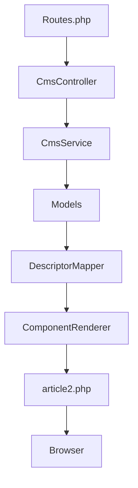
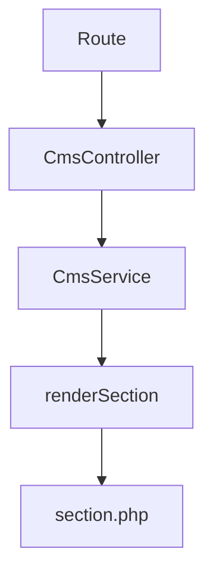
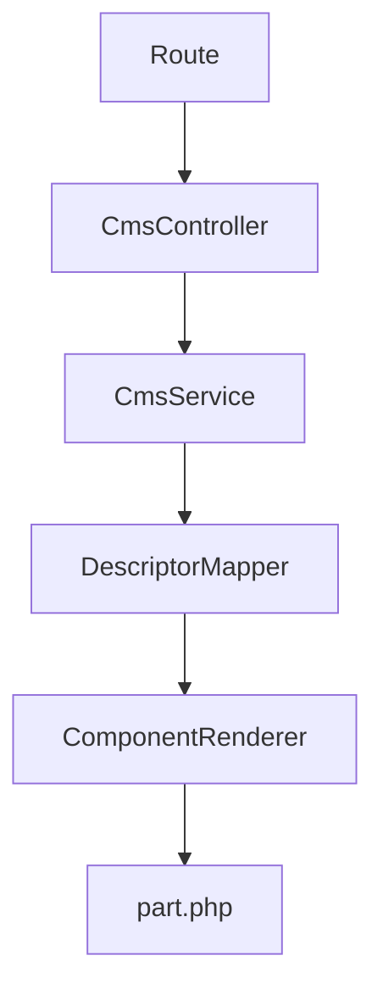

# CmsController

Le contrôleur **CmsController** est le point d'entrée public du CMS.

Il reçoit les requêtes HTTP, délègue les traitements à **CmsService** puis retourne les vues du CMS.

**Code source :**

- [app/Controllers/CmsController.php](/refactoring/app/Controllers/CmsController.php)

---

# Responsabilités

Le contrôleur assure :

- la réception des routes publiques ;
- la validation des paramètres ;
- la gestion des erreurs (404) ;
- l'appel à CmsService ;
- le retour des vues.

Toute la logique métier est déléguée à **CmsService**.

---

# Dépendances

## Framework

- BaseController
- CodeIgniter\Exceptions\PageNotFoundException

## Services

- [app/Services/CmsService.php](/refactoring/app/Services/CmsService.php)

## Vues

- [app/Views/cms/article2.php](/refactoring/app/Views/cms/article2.php)
- [app/Views/cms/category.php](/refactoring/app/Views/cms/category.php)
- [app/Views/cms/section.php](/refactoring/app/Views/cms/section.php)
- [app/Views/cms/part.php](/refactoring/app/Views/cms/part.php)

---

# Utilisateurs

Le contrôleur est appelé par :

- [app/Config/Routes.php](/refactoring/app/Config/Routes.php)

---

# Méthodes

| Méthode | Description |
|----------|-------------|
| category() | Affichage d'une catégorie |
| article() | Affichage d'un article |
| section() | Retourne une section HTML |
| part() | Retourne un composant CMS |

---

# Flux d'exécution

## Affichage d'un article

## Affichage d'une section

## Affichage d'un composant

---

# Références

- [CmsService](/documentation/ARCHITECTURE/CmsService.md)
- [Routes](/documentation/ARCHITECTURE/Routes.md)
