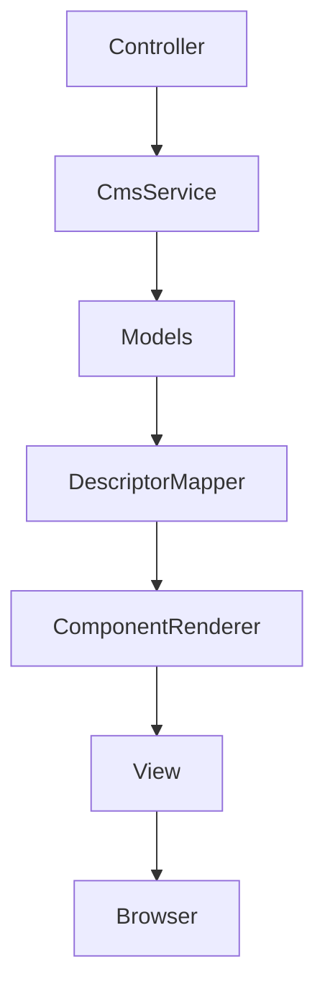

# CmsService

Le service **CmsService** est la façade du backend du CMS.

Il centralise les opérations sur les données, la construction des objets du CMS, le rendu des composants et certains services d'administration.

**Code source :**

- [app/Services/CmsService.php](/refactoring/app/Services/CmsService.php)

---

# Responsabilités

Le service assure quatre fonctions principales :

- accès aux données (Models)
- construction des structures du CMS
- rendu des composants
- services d'administration

---

# Dépendances

## Models

- [app/Models/CmsCategoryModel.php](/refactoring/app/Models/CmsCategoryModel.php)
- [app/Models/CmsArticleModel.php](/refactoring/app/Models/CmsArticleModel.php)
- [app/Models/CmsSectionModel.php](/refactoring/app/Models/CmsSectionModel.php)
- [app/Models/CmsPartModel.php](/refactoring/app/Models/CmsPartModel.php)

## Components

- [app/Libraries/Components/DescriptorMapper.php](/refactoring/app/Libraries/Components/DescriptorMapper.php)
- [app/Libraries/Components/ComponentRenderer.php](/refactoring/app/Libraries/Components/ComponentRenderer.php)
- [app/Libraries/Components/AdminComponentRenderer.php](/refactoring/app/Libraries/Components/AdminComponentRenderer.php)

---

# Utilisateurs

Le service est utilisé par :

- [app/Controllers/CmsController.php](/refactoring/app/Controllers/CmsController.php)
- [app/Controllers/Admin/CmsPart.php](/refactoring/app/Controllers/Admin/CmsPart.php)
- [app/Controllers/Admin/CmsTree.php](/refactoring/app/Controllers/Admin/CmsTree.php)

---

# Organisation des méthodes

## Categories

- getCategory()
- getFullCategory()
- renderCategory()

## Articles

- getArticle()
- getArticlesByCategory()
- getPublishedArticle()
- getArticleTree()
- getFullArticle()
- renderArticle()

## Sections

- getSection()
- getAllSections()
- getSectionsByArticle()
- getPublishedSection()
- renderSection()
- renderSectionBySlug()

## Parts

- getPart()
- getParts()
- getAllParts()
- getPartsBySection()
- renderPart()
- renderPartEditor()
- enrichPart()
- newPart()
- insertPart()
- createPart()
- updatePart()
- deletePart()
- swapPosition()
- movePartUp()
- movePartDown()

## Composants

- loadDescriptors()
- getComponentTypes()

## Administration

- adminLinks()
- getCmsTree()

---

# Flux principal

Voir également :

- [CmsController](/documentation/ARCHITECTURE/CmsController.md)
- [DescriptorMapper](/documentation/ARCHITECTURE/DescriptorMapper.md)
- [ComponentRenderer](/documentation/ARCHITECTURE/ComponentRenderer.md)
