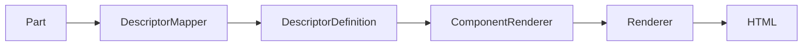

# DescriptorDefinition

Le **DescriptorDefinition** est le contrat d'exécution des composants du CMS.

Il décrit **quoi exécuter**, indépendamment du langage, du moteur de rendu ou du framework.

Il ne représente ni un modèle métier, ni une vue, ni un DTO.

Le code source :

- [app/Libraries/Components/DescriptorDefinition.php](/refactoring/app/Libraries/Components/DescriptorDefinition.php)

---

# Principe

Le Descriptor contient uniquement les informations nécessaires à la création d'un runtime.

```text
Descriptor
    │
    ├── type
    └── config
```

Le runtime peut être :

- Mermaid
- ApexCharts
- Leaflet
- Three.js
- demain un SceneWorkbench
- tout autre composant enregistré

Le Descriptor est donc un **contrat d'exécution**.

---

# Structure minimale

```php
[
    'type'   => 'three',
    'config' => [ ... ]
]
```

Le contenu de `config` dépend uniquement du type du composant.

---

# Cycle d'utilisation



Le Descriptor ne réalise aucun rendu.

Il est uniquement transmis entre les différentes couches de l'architecture.

---

# Règles

Le Descriptor :

- ne contient aucune logique métier ;
- ne contient aucun code HTML ;
- ne contient aucun code JavaScript ;
- ne contient aucune référence DOM ;
- ne dépend d'aucun moteur de rendu.

Son rôle est uniquement de décrire un runtime.

---

# Dépendances

Aucune.

Le Descriptor est volontairement indépendant des Renderers et des composants.

---

# Utilisateurs

Le Descriptor est utilisé par :

- [app/Libraries/Components/DescriptorMapper.php](/refactoring/app/Libraries/Components/DescriptorMapper.php)
- [app/Libraries/Components/ComponentRenderer.php](/refactoring/app/Libraries/Components/ComponentRenderer.php)
- [app/Libraries/Components/AdminComponentRenderer.php](/refactoring/app/Libraries/Components/AdminComponentRenderer.php)

ainsi que par l'ensemble des Renderers spécialisés.

---

# Remarque

Le dépôt contient actuellement deux implémentations :

- [app/Libraries/Components/DescriptorDefinition.php](/refactoring/app/Libraries/Components/DescriptorDefinition.php)
- [app/Libraries/Cms/DescriptorDefinition.php](/refactoring/app/Libraries/Cms/DescriptorDefinition.php)

Cette situation devra être vérifiée durant l'audit afin de conserver une implémentation unique.
