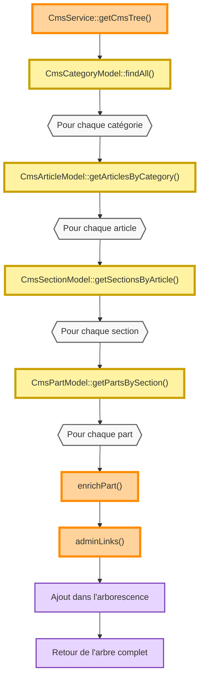

# Fonctionnement interne de `CmsService::getCmsTree()`

## Objectif

`CmsService::getCmsTree()` construit une représentation hiérarchique complète du CMS destinée à l'administration.

Cette méthode ne réalise aucun rendu HTML.

Elle construit uniquement une structure de données qui sera ensuite affichée par les vues :

* `app/Views/admin/cmstree/index.php`
* `app/Views/admin/cmstree/node.php`

---

# Principe général

La construction s'effectue de manière descendante.

```text
Catégorie
    ↓
Article
    ↓
Section
    ↓
Part
```

Chaque niveau est obtenu à partir de son modèle dédié.

---

# Algorithme



---

# Étapes

## 1. Lecture des catégories

Le parcours débute par la lecture de toutes les catégories.

Chaque catégorie devient un nœud racine.

---

## 2. Lecture des articles

Pour chaque catégorie :

* récupération des articles ;
* création des nœuds enfants.

---

## 3. Lecture des sections

Chaque article récupère la liste de ses sections.

Les sections sont ordonnées suivant leur position.

---

## 4. Lecture des composants

Pour chaque section :

* récupération des `Parts` ;
* enrichissement des données ;
* génération des liens d'administration.

---

## 5. Enrichissement

Chaque composant passe successivement par :

```text
Part
    ↓
enrichPart()
    ↓
adminLinks()
```

Cette étape ajoute notamment :

* le nom du type de composant ;
* les informations nécessaires aux vues ;
* les actions d'administration.

---

# Structure produite

La méthode retourne une hiérarchie proche de la structure suivante :

```text
Catégorie
└── Articles[]
    └── Sections[]
        └── Parts[]
```

Chaque nœud contient :

* ses données métier ;
* sa collection d'enfants ;
* les informations nécessaires à l'administration.

---

# Responsabilités

`getCmsTree()` est responsable de :

* construire la hiérarchie du CMS ;
* agréger les données provenant des modèles ;
* enrichir les composants ;
* préparer les informations destinées aux vues.

Elle n'est pas responsable :

* du rendu HTML ;
* de la navigation utilisateur ;
* de la logique JavaScript.

---

# Dépendances

## Modèles

* `CmsCategoryModel`
* `CmsArticleModel`
* `CmsSectionModel`
* `CmsPartModel`

## Méthodes internes

* `CmsService::enrichPart()`
* `CmsService::adminLinks()`

## Vues consommatrices

* `app/Views/admin/cmstree/index.php`
* `app/Views/admin/cmstree/node.php`

---

# Évolutions possibles

Cette méthode constitue aujourd'hui le générateur de l'arborescence d'administration.

À terme, cette structure pourra être réutilisée par :

* `CmsTreeWorkbench` ;
* `ArticleWorkbench` ;
* `SceneWorkbench` ;
* les futurs explorateurs de ressources.

L'objectif est de conserver `getCmsTree()` comme fournisseur unique de la hiérarchie CMS, indépendamment de l'interface utilisateur utilisée.
