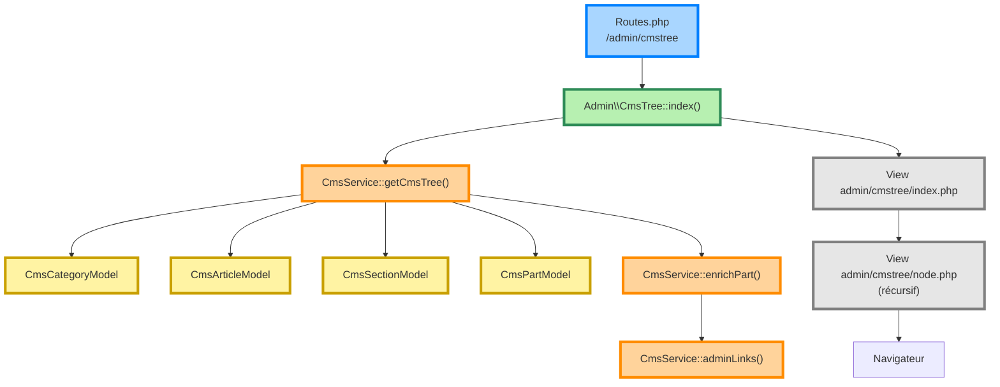
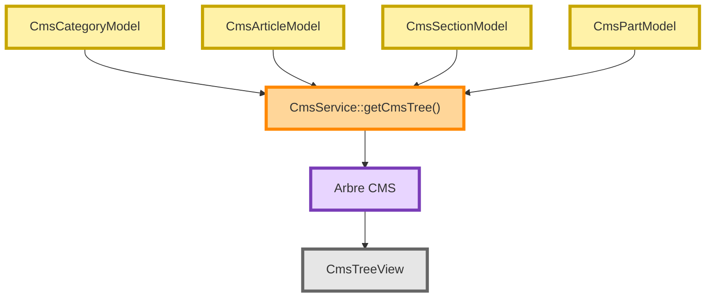

# Flux d'administration : `/admin/cmstree`

## Objectif

La route `/admin/cmstree` constitue le point d'entrée principal de l'administration du CMS.

Elle construit une représentation arborescente complète du contenu publié afin de permettre :

* la navigation dans le CMS ;
* l'accès rapide aux opérations d'administration ;
* l'édition des catégories, articles, sections et composants.

---

# Flux global



---

# Description

## 1. Route

La route `/admin/cmstree` est déclarée dans `app/Config/Routes.php`.

Elle est associée au contrôleur `Admin\CmsTree`.

---

## 2. Contrôleur

Le contrôleur `Admin\CmsTree::index()` délègue entièrement la construction de l'arbre au `CmsService`.

Aucune logique métier n'est implémentée dans le contrôleur.

---

## 3. Construction de l'arbre

`CmsService::getCmsTree()` construit une hiérarchie complète :

```text
Catégorie
└── Article
    └── Section
        └── Part
```

Chaque niveau est obtenu à partir de son modèle dédié.

### Flux de données


---

## 4. Enrichissement des composants

Avant le rendu, chaque `Part` est enrichie.

Cette étape permet notamment :

* d'associer le type de composant ;
* d'ajouter les informations utiles à l'administration ;
* de préparer les liens d'action.

Cette responsabilité est assurée par :

* `CmsService::enrichPart()`
* `CmsService::adminLinks()`

---

## 5. Rendu

Le contrôleur transmet l'arbre à la vue :

```text
admin/cmstree/index.php
```

L'affichage est ensuite réalisé récursivement par :

```text
admin/cmstree/node.php
```

Chaque nœud affiche :

* son libellé ;
* son type ;
* les actions disponibles ;
* ses enfants.

---

# Responsabilités

| Élément          | Responsabilité                          |
| ---------------- | --------------------------------------- |
| Routes           | Associer l'URL au contrôleur            |
| Admin\CmsTree    | Point d'entrée HTTP                     |
| CmsService       | Construction de l'arbre CMS             |
| CmsCategoryModel | Lecture des catégories                  |
| CmsArticleModel  | Lecture des articles                    |
| CmsSectionModel  | Lecture des sections                    |
| CmsPartModel     | Lecture des composants                  |
| enrichPart()     | Enrichissement métier des composants    |
| adminLinks()     | Génération des actions d'administration |
| index.php        | Vue principale                          |
| node.php         | Rendu récursif de l'arborescence        |

---

# Documents associés

* [[ARCHITECTURE-OVERVIEW]]
* [[CmsService]]
* [[CmsController]]
* [[DescriptorMapper]]
* [[DescriptorDefinition]]

---

# Évolutions prévues

Cette vue constitue la base de l'administration actuelle.

À terme, les formulaires HTML seront progressivement remplacés par des **Workbench** spécialisés (ArticleWorkbench, SectionWorkbench, PartWorkbench, ModelWorkbench, SceneWorkbench), tout en conservant `CmsService` comme point central de la logique métier.
