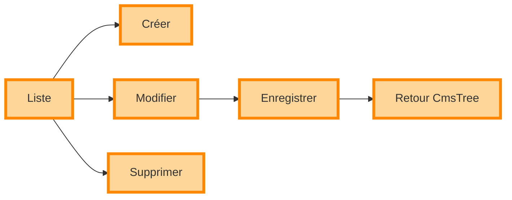
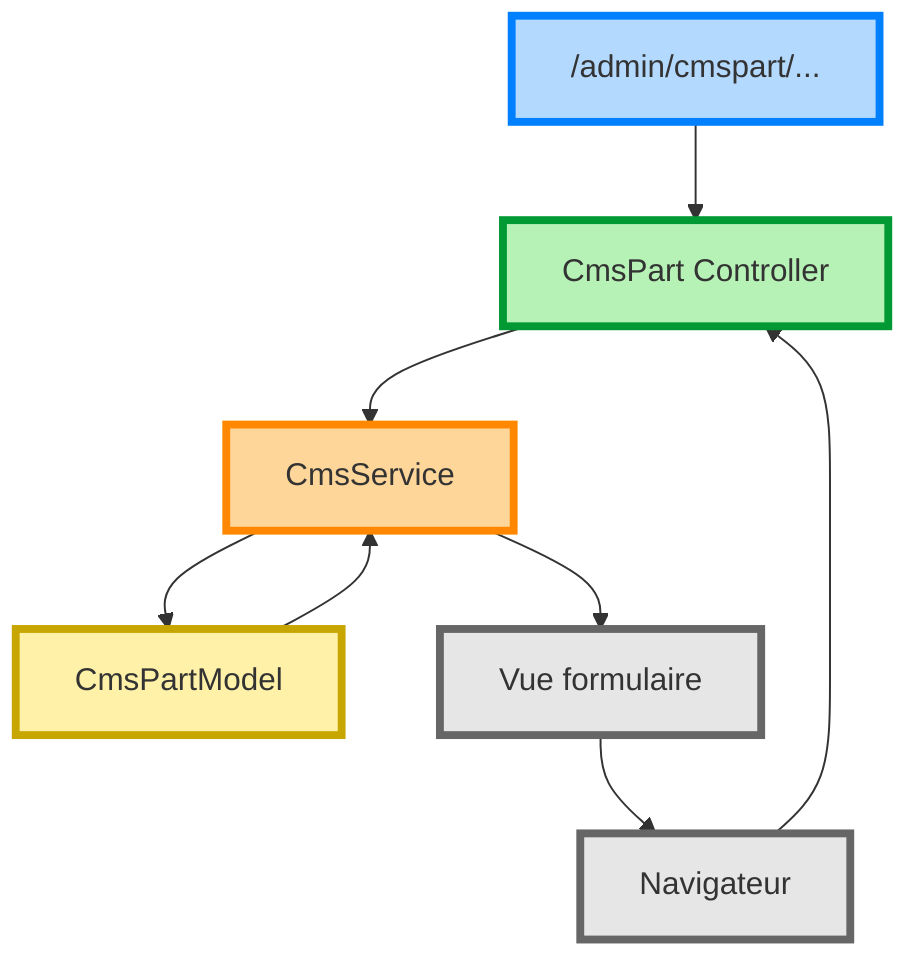

# Flux d'administration — CRUD des Parts

Une Part représente la plus petite unité éditable du CMS.

Les opérations CRUD permettent de créer, modifier, déplacer et supprimer une Part.

---

## Cycle de vie

---

## Flux d'appels

---

## Opérations

Le service centralise les opérations :

- `newPart()`
- `createPart()`
- `insertPart()`
- `updatePart()`
- `deletePart()`
- `movePartUp()`
- `movePartDown()`
- `swapPosition()`

---

## Particularité

Le CRUD manipule uniquement les données.

Aucun composant n'est créé pendant ces opérations.
