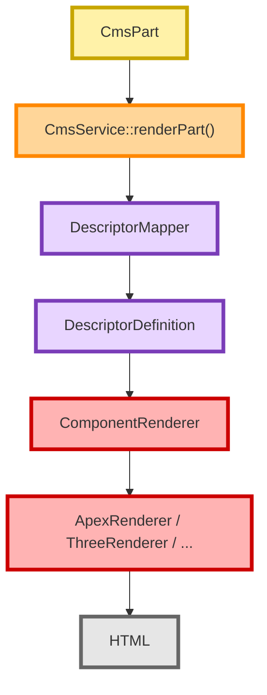

# Flux d'administration — Rendu d'une Part

Le rendu d'une Part intervient lors de la prévisualisation ou de l'affichage.

Contrairement au CRUD, ce flux construit un composant exécutable.

---

## Flux d'appels

---

## Principe

Le CRUD modifie les données.

Le rendu transforme ces données en composant exécutable.

Ces deux responsabilités restent volontairement séparées.
