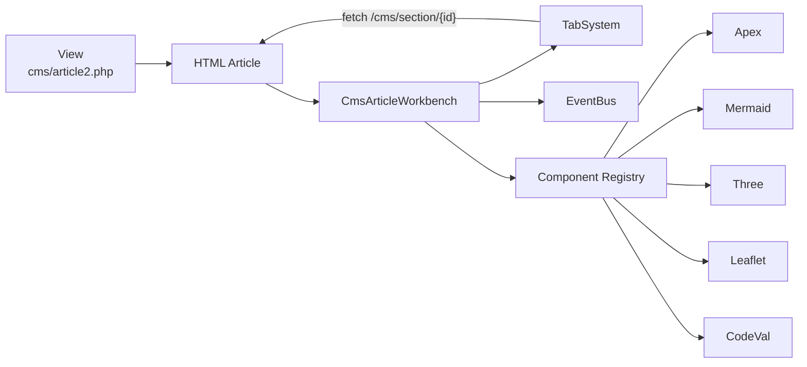
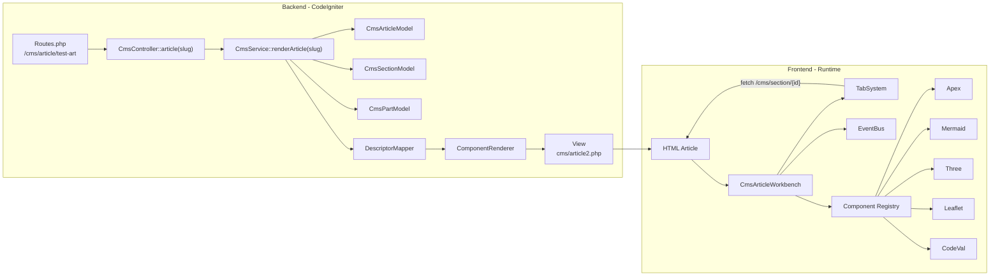

### Le backend ne connaît pas le Workbench
Il produit simplement du HTML.
Le backend termine son travail à la vue :
```
ComponentRenderer -> View article2.php
```
```
Navigateur
      │
      ▼
Routes.php
      │
      ▼
CmsController::article()
      │
      ├── getPublishedArticle()
      ├── getSectionsByArticle()
      └── renderArticle()
                │
                ▼
         getFullArticle()
                │
                ▼
        renderSection()
                │
                ▼
          renderPart()
                │
                ▼
        DescriptorMapper
                │
                ▼
      DescriptorDefinition
                │
                ▼
       ComponentRenderer
                │
                ▼
        XxxRenderer
                │
                ▼
           article2.php
                │
                ▼
          Navigateur
```
---

### Le frontend possède maintenant son propre runtime
Le HTML est ensuite pris en charge par : CmsArticleWorkbench

qui devient responsable de :
- organisation de la page ;
- chargement différé des sections ;
- initialisation des composants ;
- communication via EventBus.





---

### Le Workbench orchestre les composants
Le Workbench devient le point d'entrée du runtime JavaScript.

```
Workbench
    ↓
Component Registry
    ↓
initApex() | initMermaid() | initThree()

```

---

### TabSystem devient un composant d'infrastructure

Le chargement différé est désormais :

```
Workbench
      ↓
TabSystem
      ↓
fetch()
      ↓
/cms/section/{id}
      ↓
HTML
      ↓
initRegisteredComponentsIn()
```

On sépare ainsi deux responsabilités :

- navigation ;
- initialisation des composants.




