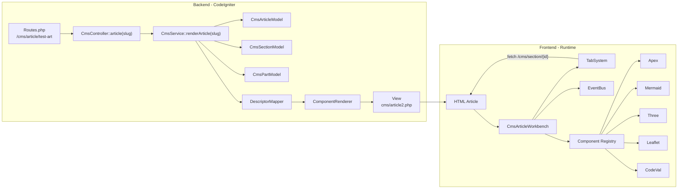

```
Navigateur
      │
      ▼
Routes.php
      │
      ▼
CmsController::article()
      │
      ├── getPublishedArticle()
      ├── getSectionsByArticle()
      └── renderArticle()
                │
                ▼
         getFullArticle()
                │
                ▼
        renderSection()
                │
                ▼
          renderPart()
                │
                ▼
        DescriptorMapper
                │
                ▼
      DescriptorDefinition
                │
                ▼
       ComponentRenderer
                │
                ▼
        XxxRenderer
                │
                ▼
           article2.php
                │
                ▼
          Navigateur
```




