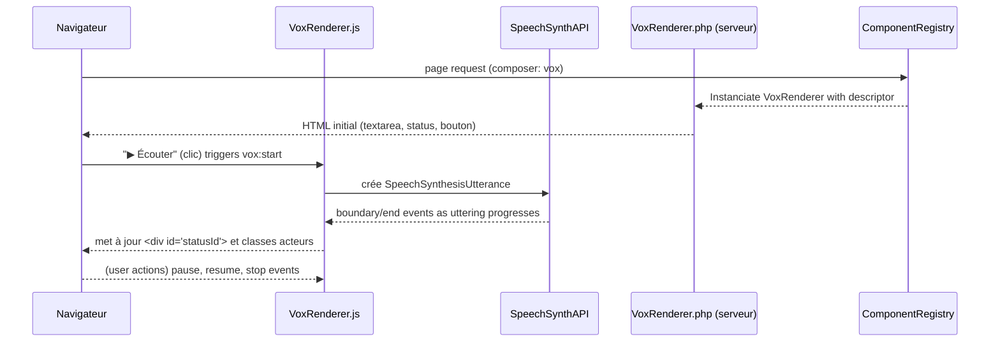
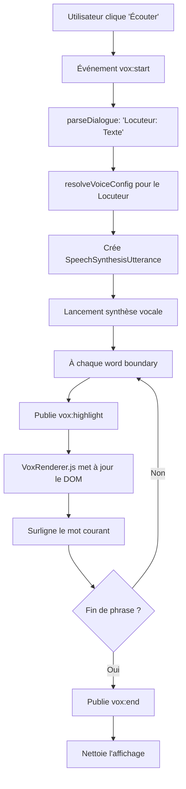

# Composant Vox - Synthèse Vocale

## Table des matières
1. [Résumé exécutif](#résumé-exécutif)
2. [Analyse du code existant](#analyse-du-code-existant)
3. [Architecture proposée](#architecture-proposée)
4. [Implémentation](#implémentation)
5. [Tests et migration](#tests-et-migration)
6. [Diagrammes](#diagrammes)
7. [Références](#références)

---

## Résumé exécutif

Le composant Vox fournit une synthèse vocale guidée par des phrases du type « Locuteur : texte ». Dans l'ancien CMS, l'article 9 (controller Cms.php) contient un exemple de scénario (« Juliette : Bonjour… ») et des boutons JS qui émettent des événements sur le bus (vox:start, vox:pause, etc.). Ce dispositif exploite l'API Web Speech (SpeechSynthesis) pour faire parler l'application. Les fichiers JS (vox.js, vox.renderer.js, vox.listen.js) orchestrent cette logique : parse des dialogues avec un préfixe Locuteur: message via une regex, configuration de la voix (index, débit, hauteur, volume) à partir d'un mapping state.aliases défini (p. ex. Romeo, Juliette), et rendu HTML du texte lu dans un élément de statut. L'ancienne page statique intègre aussi un bloc statique pour le référencement SEO (lien vers mermaid), ce qui reste utile.

Nous proposons d'implémenter un VoxRenderer PHP minimal conforme à l'architecture des composants du nouveau CMS. Ce renderer prendra en charge un descripteur contenant au moins le texte à dire (avec syntaxe Locuteur: phrase), l'id de l'élément statusId pour l'affichage, et les options vocales (langue, voix, débit, pitch, volume). En sortie, il générera le HTML nécessaire : une zone de texte (ou un élément caché) contenant le dialogue et un conteneur de statut (comme <div id="VOX_STATUS">). L'enregistrement de cet acteur se fera via le ComponentRegistry existant (par ex. ComponentRegistry::set('vox', VoxComponent::class)).

Ce rapport détaille : (1) l'analyse du code PHP du controller (article 9) pour extraire le format de données et la syntaxe « Locuteur: message » ; (2) l'inspection des fichiers JS pour documenter la logique de parsing, l'API d'événements utilisée, les paramètres vocaux (lang, rate, pitch, voiceIndex/name), et le DOM produit ; (3) le flux de données attendu (descripteur Vox → JS VoxRenderer → vue PHP → navigateur, avec pages statiques pour le SEO) ; (4) une ébauche d'implémentation PHP minimale (classe, schéma de descripteur, vue exemplaire HTML) ; (5) une stratégie de tests et un plan de migration vers la mise en scène (Composite/Scene) ; (6) exemples de code et un diagramme Mermaid pour l'architecture, plus un échéancier des tâches. Des hypothèses sont clairement notées (p. ex. API du registre de composants, etc.), et l'on fournit des commandes utiles (git, serveur PHP, contrôles navigateurs).

---

## Analyse du code existant

### 1. Controller Cms.php (article id=9)

Dans `old/app/Controllers/Cms.php` la section Article 9 – Vox définit manuellement le contenu et l'interface d'exemple du composant Vox. On y trouve :

#### Texte de dialogue (textarea)

Par exemple :
```
Juliette: Bonjour, je suis Juliette.
Romeo: Bonjour, je suis Roméo.
```

Chaque ligne suit la syntaxe `Locuteur: Message`. C'est cette convention que `vox.js` analyse pour séparer le nom du locuteur et son texte.

#### Boutons de contrôle

Exemples de boutons qui publient des événements sur le bus JS :
```html
<button onclick="window.eventBusPublish(event,'vox:start',
      { targetId:'TXT_VOX_1', statusId:'VOX_STATUS' })">Lire</button>
<button onclick="window.eventBusPublish(event,'vox:pause')">Pause</button>
<button onclick="window.eventBusPublish(event,'vox:stop')">Stop</button>
<button onclick="window.eventBusPublish(event,'vox:rate',{value:this.value})">Rate</button>
<button onclick="window.eventBusPublish(event,'vox:volume',{value:this.value})">Volume</button>
<button onclick="window.eventBusPublish(event,'vox:getVoices')">Configurer les voix</button>
```

Ces boutons déclenchent les principales actions :
- `vox:start` (lecture) avec le texte ciblé et l'ID du conteneur de statut
- `vox:pause`, `vox:resume`, `vox:stop` pour piloter la synthèse
- `vox:rate` et `vox:volume` pour ajuster respectivement la vitesse et le volume
- `vox:getVoices` pour lister les voix disponibles

#### Paramètres vocaux

Bien que l'article n'en comporte pas explicitement, l'interface prévoit de régler voix, taux, pitch, volume via JavaScript. Par exemple, un `<input type="range">` publie `vox:rate` ou `vox:volume`.

---

### 2. Scripts JS (vox.js, vox.renderer.js, vox.listen.js)

#### 2.1 Logiques de parsing et d'état dans vox.js

Le fichier `vox.js` gère la logique principale de la synthèse vocale. On y trouve notamment :

**Un état global `state`** comprenant :
- `voice`, `voices`, `allVoices` (gestion des voix du navigateur)
- `lang` (langue par défaut, p.ex. "fr-FR")
- Des paramètres (`rate`, `pitch`, `volume`)
- Un mapping `aliases` associant un alias de locuteur à un set de paramètres vocaux personnalisés. Par exemple :

```javascript
state.aliases = {
  Romeo:   { voiceIndex: 2, rate: 1.0,  pitch: 1.0, volume: 1.0 },
  Juliette:{ voiceIndex: 0, rate: 1.2,  pitch: 1.1, volume: 0.8 },
  // d'autres alias « Enfant1 », « Enfant2 », … avec leurs réglages
}
```

Chaque entrée indique quel index dans la liste des voix (`voiceIndex`) utiliser pour cet alias, ainsi que `rate`, `pitch`, `volume` personnalisés.

**Des abonnements au bus d'événements** dans `initVoxBus()` :

```javascript
bus.subscribe('vox:speak', onSpeak);
bus.subscribe('vox:pause', onPause);
bus.subscribe('vox:resume', onResume);
bus.subscribe('vox:stop', onStop);
bus.subscribe('vox:getVoices', onGetVoices);
bus.subscribe('vox:setVoice', onSetVoice);
bus.subscribe('vox:setLang', onSetLang);
bus.subscribe('vox:rate', onRate);
bus.subscribe('vox:volume', onVolume);
```

**`onSpeak(payload)`** déclenché par `vox:start` ou `vox:speak`. Il récupère le texte à énoncer, puis :

1. Extraction du texte : `resolveText(payload)` retourne soit `payload.text`, soit le contenu d'un champ par son `targetId` (DOM), soit vide.
2. Découpage en phrases : `splitText(text)` segmente par ponctuation `.` ou `?` ou `!`.
3. Analyse de la première phrase : `parseDialogue(sentence)` utilise une regex `/^([^:]+):(.*)$/` pour séparer alias (groupe 1) et texte (groupe 2). Si le format est invalide, le alias reste nul.
4. Configuration de la voix : à partir de `alias`, on appelle `resolveVoiceConfig(alias)` qui cherche dans `state.aliases`. S'il existe, on récupère les paramètres correspondants ; sinon on utilise les valeurs par défaut dans `state`.
5. Création d'un utterance : un objet `SpeechSynthesisUtterance(sentence)` est instancié avec le texte. On assigne ensuite `utter.voice = vconfig.voice`, `utter.lang = state.lang`, `utter.rate = vconfig.rate`, `utter.pitch = vconfig.pitch`, `utter.volume = vconfig.volume`. Ces propriétés sont standard de l'API Web Speech.
6. Événements word-boundary : on attache un écouteur `utter.addEventListener('boundary', ...)` qui publie `vox:boundary` pour chaque limite de mot, afin de surligner le mot courant.
7. Lancement du parler : on appelle `synth.speak(utter)`.

**`onPause/onResume/onStop`** : appellent respectivement `speechSynthesis.pause()`, `.resume()`, `.cancel()` pour contrôler la synthèse.

**`onGetVoices()`** : publie sur le bus un événement `vox:voices:list` avec un tableau des voix disponibles.

**`onSetVoice(payload)`** : sélectionne une voix par name (recherche dans `state.allVoices`) et l'assigne à `state.voice`.

**Parsing du texte** (« Locuteur: Message ») :

```javascript
const match = sentence.trim().match(/^([^:]+):(.*)$/);
if (!match) return [{ alias: null, text: sentence.trim() }];
return [{ alias: match[1].trim(), text: match[2].trim() }];
```

Ainsi, tout texte avant `:` est considéré comme le nom du locuteur (alias). S'il n'y a pas de `:`, l'alias est null (on parle sans surligner d'acteur). Le renderer s'occupera d'afficher ce nom et/ou de surligner l'acteur.

#### 2.2 Rendu UI dans vox.renderer.js

Le fichier `vox.renderer.js` ne touche pas à la synthèse vocale, il se contente de mettre à jour le DOM pour visualiser ce que fait Vox. Ses responsabilités (en commentaires) sont : afficher la phrase courante, surligner le mot en cours, activer l'acteur qui parle, et afficher la liste des voix. Les handlers principaux sont :

**`onStart({statusId, alias, sentence})`** : reçu lors de `vox:start` ou de début de lecture. Il récupère l'élément `document.getElementById(statusId)` (par exemple `<div id="VOX_STATUS">`) et y met le texte `sentence`. Puis appelle `setActorSpeaking(alias)` pour ajouter la classe CSS `.cp_actor--speaking` sur l'élément acteur concerné (il cherche tout élément `.cp_actor` dont l'attribut `data-alias=alias`).

**`onHighlight({html, statusId})`** : lors d'un événement `vox:highlight` (généré à chaque nouvelle limite de mot), il remplace `innerHTML` de l'élément de statut par le HTML donné (en pratique, html contient le texte complet de la phrase avec le mot courant `<b>balisé ou coloré</b>`).

**`onEnd({statusId})`** : quand la lecture est terminée (`vox:end`), il nettoie l'élément de statut (`textContent='—'`) et retire la classe `.cp_actor--speaking` (via `setActorSpeaking(null)`).

**`onVoicesList({voices})`** : lors de `vox:voices:list`, affiche les voix disponibles dans la page (dans un container d'ID `VOX_VOICES_LIST`). Pour chaque voix, il insère un bloc HTML comprenant le nom, la langue, et deux boutons : "Sélectionner" et "Tester".

#### 2.3 Interaction avec vox.listen.js

Le fichier `vox.listen.js` utilise l'API `SpeechRecognition` pour la reconnaissance vocale (entrée audio). Il n'est pas central pour la synthèse Vox, mais on note que :

- Il se branche sur `SpeechRecognition` (ou `webkitSpeechRecognition` suivant le navigateur).
- Il publie des événements `listen:start`, `listen:end`, `listen:result`, etc.
- Pour Vox, cela signifie qu'il existe aussi une brique de reconnaissance vocale (Speech-To-Text) qui pourrait être utilisée ultérieurement.
- Pour le moment, le composant Vox se concentre sur la synthèse (Text-To-Speech).

#### 2.4 Synthèse vocale web (contexte)

Le code s'appuie sur l'API Web Speech (SpeechSynthesis). Conformément à la documentation MDN, un objet `SpeechSynthesisUtterance` encapsule le texte et ses paramètres de lecture (langue, voix, débit, hauteur, volume). Par exemple :

```javascript
const utter = new SpeechSynthesisUtterance("Bonjour");
utter.lang = "fr-FR";            // langue
utter.voice = voices[0];         // objet SpeechSynthesisVoice
utter.rate = 1.2;                // vitesse
utter.pitch = 1.0;               // hauteur
utter.volume = 0.8;              // volume
speechSynthesis.speak(utter);
```

---

## Architecture proposée

### Flux de données : Descripteur → VoxRenderer JS → Vue (vox.php) → Frontend SEO

#### Ancien modèle (CMS statique)

Dans l'ancien CMS, chaque page était générée par le controller Cms avec un contenu HTML statique ou semi-dynamique, puis enrichie par les scripts JS en front-end. Pour le référencement, certaines pages (comme Technologies) étaient prédéfinies pour générer du HTML complet (textes, diagrammes Mermaid, etc.) sans attendre l'exécution JS. Le composant Vox de l'article 9 était partiellement interactif : le texte du dialogue était dans le HTML (`<textarea>`), mais la lecture reposait sur les scripts décrits ci-dessus.

#### Nouveau modèle avec Composite/Scene

Dans la nouvelle architecture du CMS, le Composite (ou Scene) orchestrera des composants déclarés par des descripteurs (généralement en YAML ou JSON). Un descripteur Vox pourrait ressembler à :

```yaml
component: vox
properties:
  text: |
    Juliette: Bonjour, je suis Juliette.
    Romeo:   Bonjour Juliette, comment vas-tu ?
  statusId: 'VOX_STATUS_1'
  lang: 'fr-FR'
  pitch: 1.0
  rate: 1.0
  volume: 1.0
```

Lors de la génération de la page, le VoxRenderer PHP associera ce descripteur à un fichier de vue (par exemple `app/Views/components/vox.php`). Cette vue doit produire le HTML initial :

- Une zone contenant le texte (souvent `<textarea>` ou un élément `<div>` masqué) avec l'attribut `data-vox-text` ou l'ID de l'élément texte.
- Un conteneur pour le statut (par exemple `<div id="VOX_STATUS_1" class="vox-status">`).
- Optionnellement, des contrôles pour déclencher la synthèse (par ex. bouton « ▶ Écouter » qui publie `vox:start`).

Le fragment HTML issu pourra être enrichi côté client (comme les scripts actuels se branchant sur l'EventBus).

Ainsi le flux est :

```
[YAML Vox] --(générateur PHP)--> <section HTML> 
    (avec textarea, boutons, div#status) 
    + insertion du script client pour Vox 
    (et éventuellement event bus initialisation) 
↓
Le navigateur affiche le composant statique (texte + boutons).
L'utilisateur clique « ▶ Lire » → JS émet `vox:start`. 
VoxRenderer JS (client) reçoit, découpe le texte (via notre parsing), 
configure la voix, joue la synthèse, et publie `vox:highlight` au fur et à mesure. 
```

Les pages SEO-friendly (statistiques ou docs) peuvent rester sur des templates statiques qui incluent des textes lisibles et des diagrammes Mermaid. Pour le composant Vox non critique pour le SEO (lecture audio), il est acceptable que l'interaction soit gérée par le JS après chargement. On veillera simplement à fournir un `<textarea>` avec le texte complet (il est indexable), et un `<noscript>` ou des métadonnées si besoin pour les robots.

---

## Implémentation

### 1. Esquisse de classe PHP (VoxRenderer)

Dans la nouvelle base, chaque composant interactif a un Renderer PHP correspondant. Par analogie avec CodeValRenderer ou MermaidRenderer, on proposerait :

```php
<?php
namespace App\Components\Vox;

use App\Components\AbstractRenderer;

class VoxRenderer extends AbstractRenderer
{
    protected $descriptor;

    public function __construct(array $descriptor)
    {
        $this->descriptor = $descriptor;
    }

    /**
     * Méthode de rendu principale.
     * Renvoie le HTML pour ce composant Vox.
     */
    public function render(): string
    {
        // Extraire les propriétés du descriptor
        $text = $this->descriptor['properties']['text'] ?? '';
        $statusId = $this->descriptor['properties']['statusId'] ?? 'VOX_STATUS';
        $lang = $this->descriptor['properties']['lang'] ?? 'fr-FR';
        $pitch = $this->descriptor['properties']['pitch'] ?? 1.0;
        $rate = $this->descriptor['properties']['rate'] ?? 1.0;
        $volume = $this->descriptor['properties']['volume'] ?? 1.0;

        // Charger la vue vox.php et retourner le rendu
        return view('components/vox', [
            'text'     => $text,
            'statusId' => $statusId,
            'lang'     => $lang,
            'pitch'    => $pitch,
            'rate'     => $rate,
            'volume'   => $volume
        ])->render();
    }
}
```

Ici, on suppose un système de vues style CodeIgniter/Blade avec un helper `view()`. On passe le texte (potentiellement multilignes avec « Locuteur: phrase »), l'statusId, et les paramètres vocaux. L'objet `$descriptor` viendra du ComponentRegistry (injection du descripteur YAML).

### 2. Schéma de descripteur attendu

Le descripteur (fichier YAML/JSON) pour Vox devrait contenir au minimum :

- `text` (string, obligatoire) : le dialogue (multi-lignes, syntaxe Locuteur: phrase).
- `statusId` (string) : l'ID de l'élément DOM pour l'affichage du statut.
- Optionnels : `lang`, `rate`, `pitch`, `volume` pour personnaliser.

On conservera la compatibilité avec la syntaxe « Speaker: line ». Pour plus de flexibilité future, on pourrait envisager un format JSON plus structuré, mais au minimum on accepte text brut.

### 3. Extrait de vue vox.php

Le fichier de vue génère l'HTML suivant (exemple) :

```html
<div class="vox-component" data-lang="<?= $lang ?>" data-rate="<?= $rate ?>"
     data-pitch="<?= $pitch ?>" data-volume="<?= $volume ?>">
  <textarea id="VOX_TEXT" style="display:none;"><?= esc($text) ?></textarea>
  <div id="<?= esc($statusId) ?>" class="vox-status">—</div>
  <button class="vox-play-btn" onclick="window.eventBusPublish(event,'vox:start',
        { targetId:'VOX_TEXT', statusId:'<?= esc($statusId) ?>' })">
    ▶ Écouter
  </button>
</div>
```

On garde un `<textarea>` caché (`display:none`) contenant le texte (pour qu'il soit présent dans le DOM).
Un `<div>` avec l'id=$statusId pour afficher le retour de Vox (initialement un tiret « — »).
Un bouton Écouter qui publie `vox:start` sur le bus, ciblant VOX_TEXT et statusId.

Cette vue minimale permet au JS client de fonctionner comme avant. Bien sûr, on stylise ou classe les éléments selon besoin (CSS `vox-component`, `vox-status` etc.). Si le texte doit être indexé pour le SEO, on peut également le placer en clair dans la page (mais cela dépend de la tolérance UX).

### 4. Enregistrement dans le ComponentRegistry

On présume l'existence d'un registre de composants. Il faudrait quelque chose comme :

```php
ComponentRegistry::set('vox', [
    'renderer' => App\Components\Vox\VoxRenderer::class,
    'description' => 'Synthèse vocale multi-voix'
]);
```

Cette ligne (à ajouter dans la configuration ou un bootstrap) permet au CMS de reconnaître un composant `type: vox`. L'API exacte dépend de l'implémentation existante.

### 5. Compatibilité ascendante

Pour maintenir la compatibilité avec la syntaxe historique « Locuteur: texte », on utilise toujours la regex vue en JS. Ainsi, même si le nouveau descripteur est YAML, on n'a pas à changer les dialogues existants. Par ailleurs, on peut prévoir un format enrichi futur :

```yaml
component: vox
voices:
  - name: "Google français"
    lang: "fr-FR"
    default: true
dialog:
  - speaker: Juliette
    text: "Bonjour, je suis Juliette."
    rate: 1.2
    pitch: 1.1
  - speaker: Romeo
    text: "Bonjour Juliette, je vais bien."
```

Ce schéma plus détaillé n'est pas nécessaire au départ, mais le nouveau renderer pourrait le supporter ultérieurement. Pour l'instant, le champ `text` brut avec préfixe permet de réutiliser la logique JS existante sans effort.

---

## Tests et migration

### 1. Scénarios de test (unitaires et manuels)

- **Test d'unité – parsing de dialogue** : Vérifier qu'une ligne "Pierre: Bonjour" est correctement scindée en `{alias:"Pierre", text:"Bonjour"}`. Tester aussi le cas sans `:` (alias nul).
- **Test d'unité – composition HTML** : Le renderer PHP doit générer un HTML contenant exactement le texte donné et les bons attributs (IDs, data-*). On peut comparer un fragment de sortie avec une chaîne attendue.
- **Test unitaire – paramètres vocaux** : Si on passe `rate:1.5` dans le descripteur, le HTML result.e doit intégrer `data-rate="1.5"`. On peut vérifier que le JS client lit ces valeurs.
- **Test manuel – lecture vocal** : Déployer en local, ouvrir la page avec le composant Vox, cliquer « Écouter », et s'assurer que la synthèse vocale prononce bien le texte complet, avec la bonne voix/langue. Tester aussi le surlignage des mots (mot en surbrillance en cours de lecture).
- **Test manuel – sélection de voix** : Cliquer sur « Configurer les voix » (déclenche `vox:getVoices`), vérifier que la liste s'affiche, sélectionner une autre voix, tester.
- **Test manuel – contrôles** : Vérifier les boutons Pause/Resume/Stop fonctionnent bien.
- **Test unité – absence de dépendance** : Charger la page sans JS (mode NoScript) : le `<textarea>` devrait montrer le texte du dialogue, assurant un fallback minimal (texte indexable).

Chaque test devra être validé sur plusieurs navigateurs (Chrome, Firefox) car les APIs de synthèse vocale varient.

### 2. Plan de migration vers Composite/Scene

Actuellement, nous avons un prototype Vox « monolithe » dans Cms. Pour intégrer proprement :

1. **Migration du contenu** : Conserver l'article d'exemple (id=9) pour documentation interne, mais créer un composant Vox qui lit des descripteurs depuis la BDD ou fichiers YAML. Remplacer le bloc `<textarea>` statique par le rendu du VoxRenderer.
2. **Désactivation de l'ancien code** : Supprimer ou désactiver le code JavaScript monolithique `old/js/vox.js` si le nouveau composant le remplace. En gardant, il risque de conflits. On garde idéalement uniquement le code de `vox.renderer.js` adapté.
3. **Intégration dans Composite/Scene** : Placer le composant Vox dans une Scène (ou Layout) qui orchestre les vues. Par exemple, une page de démonstration pourrait être une "scene" avec un Header, un VoxComponent, un Footer, etc. On veillera à ce que les IDs (ex. VOX_STATUS) soient uniques dans la page; on peut générer dynamiquement un ID via le descripteur si nécessaire.
4. **SEO** : Vérifier que les balises `<noscript>` ou méta descriptions mentionnent la présence du dialogue. Ajouter un fallback lisible si besoin.
5. **Retours d'expérience** : Après validation de base, recueillir les premiers retours utilisateurs (p.ex. accessibilité, performance). Ajuster l'UI (icônes, labels) et l'expérience (par ex. exécution automatique ou non).

---

## Diagrammes

### Flux d'interaction Vox



### Cycle de vie d'une phrase Vox



---

## Références

- **MDN Web Docs** – [SpeechSynthesisUtterance](https://developer.mozilla.org/en-US/docs/Web/API/SpeechSynthesisUtterance) (API de synthèse vocale), qui décrit les propriétés lang, voice, rate, pitch, volume et l'usage de `speechSynthesis.getVoices()`.
- **CodeIgniter 4** – [Controllers](https://codeigniter.com/user_guide/incoming/controllers.html), [Views](https://codeigniter.com/user_guide/outgoing/views.html) pour l'organisation MVC.
- **Documentation du projet** – ComponentRegistry, Composite/Scene, descripteurs.
- **Fichiers source** :
  - `old/app/Controllers/Cms.php` (article 9 – exemple Vox)
  - `old/public/assets/js/core/vox.js` (synthèse vocale)
  - `old/public/assets/js/core/vox.renderer.js` (rendu UI)
  - `old/public/assets/js/core/vox.listen.js` (reconnaissance vocale)

---

## Notes et hypothèses

- **API Registry** : L'implémentation exacte du registre de composants n'est pas spécifiée. On a supposé un appel `ComponentRegistry::set('vox', VoxComponent::class)`. Il faudra s'adapter à la méthode existante.
- **IDs dynamiques** : Si plusieurs instances de Vox sont sur la même page, il faut générer des `statusId` uniques (ex. via un compteur). Le descripteur peut permettre de passer un `statusId` ou on peut en assigner un par défaut.
- **Multilingue** : La langue est réglable via `lang`. On suppose que le front récupère `data-lang` ou `lang` dans la view, mais le JS actuel utilisait seulement `state.lang` global. On a ajouté `data-lang` dans l'exemple pour plus de clarté.
- **Backwards compatibility** : Les anciennes phrases dans la base (CMS > Cms.php) peuvent être progressivement migrées en YAML si nécessaire, mais la syntaxe « Nom: Texte » reste supportée en l'état.

---

## Tableau récapitulatif

| Fichier/Source | Responsabilité | État actuel | Nouveau livrable |
|---|---|---|---|
| Cms.php (article Vox) | Prototype de dialogue vocal et contrôles UI | Texte en dur, boutons JS | Vu comme référence, ne sera plus utilisé directement |
| old/public/js/core/vox.js | Logique de synthèse : parse, queue, utterance | Ancien module monolithique | Réinjectée partiellement dans JS modernisé |
| old/public/js/core/vox.renderer.js | Mise à jour du DOM (statu texte, surlignage) | Existant, réutilisable | Migré et adapté |
| old/public/js/core/vox.listen.js | Reconnaissance vocale | Indépendant | Documenté, peut être réutilisé ultérieurement |
| app/Views/components/vox.php | À créer : template HTML du composant | — | HTML du composant (textarea caché, div status, bouton) |
| VoxRenderer.php | À créer : classe Renderer côté serveur | — | Lit le descriptor, rend la vue vox.php |
| ComponentRegistry | Enregistrement du composant | Contient (probablement) référence | Ajouter l'entrée 'vox'=>VoxComponent |

---

**Statut** : Documentation de conception  
**Dernière mise à jour** : 2026-07-02  
**Auteur** : Architecture CMS Team
