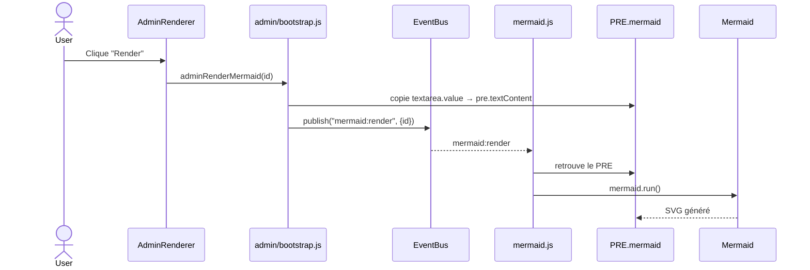

```mermaid
sequenceDiagram

    actor User

    participant AR as AdminRenderer
    participant JS as admin/bootstrap.js
    participant BUS as EventBus
    participant MC as mermaid.js
    participant DOM as PRE.mermaid
    participant M as Mermaid

    User->>AR: Clique "Render"

    AR->>JS: adminRenderMermaid(id)

    JS->>DOM: copie textarea.value → pre.textContent

    JS->>BUS: publish("mermaid:render", {id})

    BUS-->>MC: mermaid:render

    MC->>DOM: retrouve le PRE

    MC->>M: mermaid.run()

    M-->>DOM: SVG généré

```
