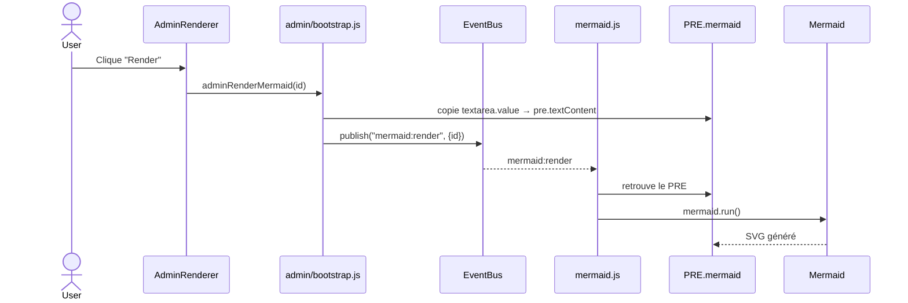
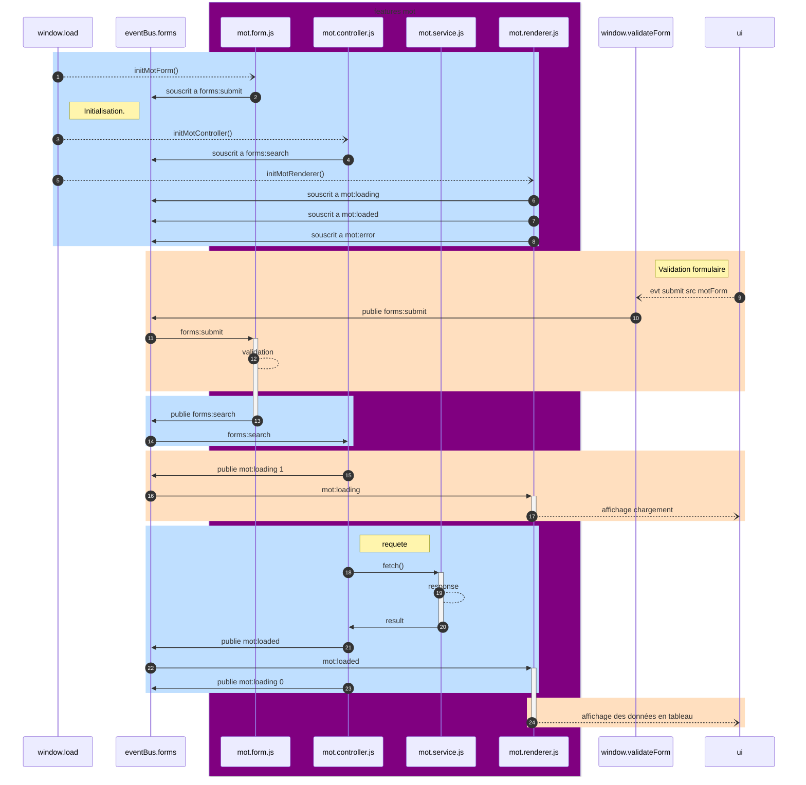

# Flux d'éxecution

## 1. renud Mermaid (AdminRenderer) 

```mermaid
sequenceDiagram

    actor User

    participant AR as AdminRenderer
    participant JS as admin/bootstrap.js
    participant BUS as EventBus
    participant MC as mermaid.js
    participant DOM as PRE.mermaid
    participant M as Mermaid

    User->>AR: Clique "Render"

    AR->>JS: adminRenderMermaid(id)

    JS->>DOM: copie textarea.value → pre.textContent

    JS->>BUS: publish("mermaid:render", {id})

    BUS-->>MC: mermaid:render

    MC->>DOM: retrouve le PRE

    MC->>M: mermaid.run()

    M-->>DOM: SVG généré

```
## Cycle de vie composant (avant refatoring)

```mermaid
    sequenceDiagram
    autonumber
    
    participant window.load
    participant eventBus.forms
    box Purple features mot
    participant mot.form.js
    participant mot.controller.js
    participant mot.service.js
    participant mot.renderer.js
    end
    participant window.validateForm
    participant ui
    
    rect rgb(191, 223, 255)
        window.load--)mot.form.js: initMotForm()
        mot.form.js->>eventBus.forms : souscrit a forms:submit
        note right of window.load: Initialisation.
        
        window.load--)mot.controller.js: initMotController()  
        mot.controller.js->>eventBus.forms : souscrit a forms:search
    
        window.load--)mot.renderer.js : initMotRenderer()
        mot.renderer.js->>eventBus.forms : souscrit a mot:loading
        mot.renderer.js->>eventBus.forms : souscrit a mot:loaded
        mot.renderer.js->>eventBus.forms : souscrit a mot:error
    end
    
    rect rgb(255, 223, 191)
        note left of ui: Validation formulaire
        ui--)window.validateForm: evt submit src motForm  
        window.validateForm->>eventBus.forms : publie forms:submit
        eventBus.forms->>+mot.form.js : forms:submit
        mot.form.js-->mot.form.js : validation
    end
    
    rect rgb(191, 223, 255)
        mot.form.js->>-eventBus.forms : publie forms:search
        eventBus.forms->>mot.controller.js: forms:search
    end
    
    rect rgb(255, 223, 191)
        mot.controller.js->>eventBus.forms : publie mot:loading 1
        eventBus.forms->>+mot.renderer.js : mot:loading
        mot.renderer.js--)-ui : affichage chargement
    end
    
    rect rgb(191, 223, 255)	
        note left of mot.service.js : requete
        mot.controller.js->>+mot.service.js : fetch()
        mot.service.js-->mot.service.js : response
        mot.service.js->>-mot.controller.js :result
        mot.controller.js->>eventBus.forms : publie mot:loaded
        eventBus.forms->>+mot.renderer.js: mot:loaded
        mot.controller.js->>eventBus.forms : publie mot:loading 0
    end
    
    rect rgb(255, 223, 191)
        mot.renderer.js--)-ui : affichage des données en tableau
    end
```
