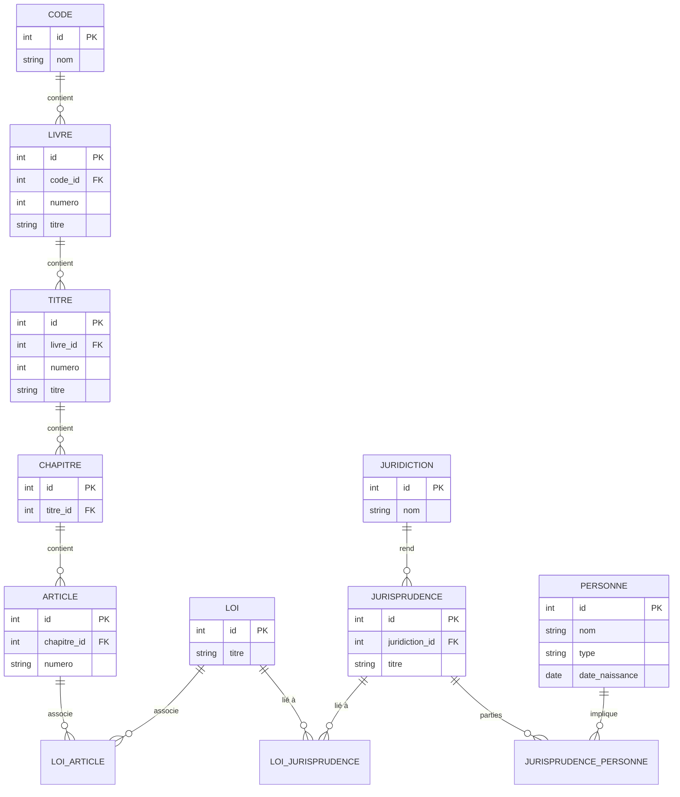

```mermaid
erDiagram

    CODE ||--o{ LIVRE : contient
    LIVRE ||--o{ TITRE : contient
    TITRE ||--o{ CHAPITRE : contient
    CHAPITRE ||--o{ ARTICLE : contient

    LOI ||--o{ LOI_ARTICLE : "associe"
    ARTICLE ||--o{ LOI_ARTICLE : "associe"

    JURIDICTION ||--o{ JURISPRUDENCE : "rend"

    LOI ||--o{ LOI_JURISPRUDENCE : "lié à"
    JURISPRUDENCE ||--o{ LOI_JURISPRUDENCE : "lié à"

    PERSONNE ||--o{ JURISPRUDENCE_PERSONNE : "implique"
    JURISPRUDENCE ||--o{ JURISPRUDENCE_PERSONNE : "parties"

    CODE {
        int id PK
        string nom
    }

    LIVRE {
        int id PK
        int code_id FK
        int numero
        string titre
    }

    TITRE {
        int id PK
        int livre_id FK
        int numero
        string titre
    }

    CHAPITRE {
        int id PK
        int titre_id FK
    }

    ARTICLE {
        int id PK
        int chapitre_id FK
        string numero
    }

    LOI {
        int id PK
        string titre
    }

    JURIDICTION {
        int id PK
        string nom
    }

    JURISPRUDENCE {
        int id PK
        int juridiction_id FK
        string titre
    }

    PERSONNE {
        int id PK
        string nom
        string type
        date date_naissance
    }

```
