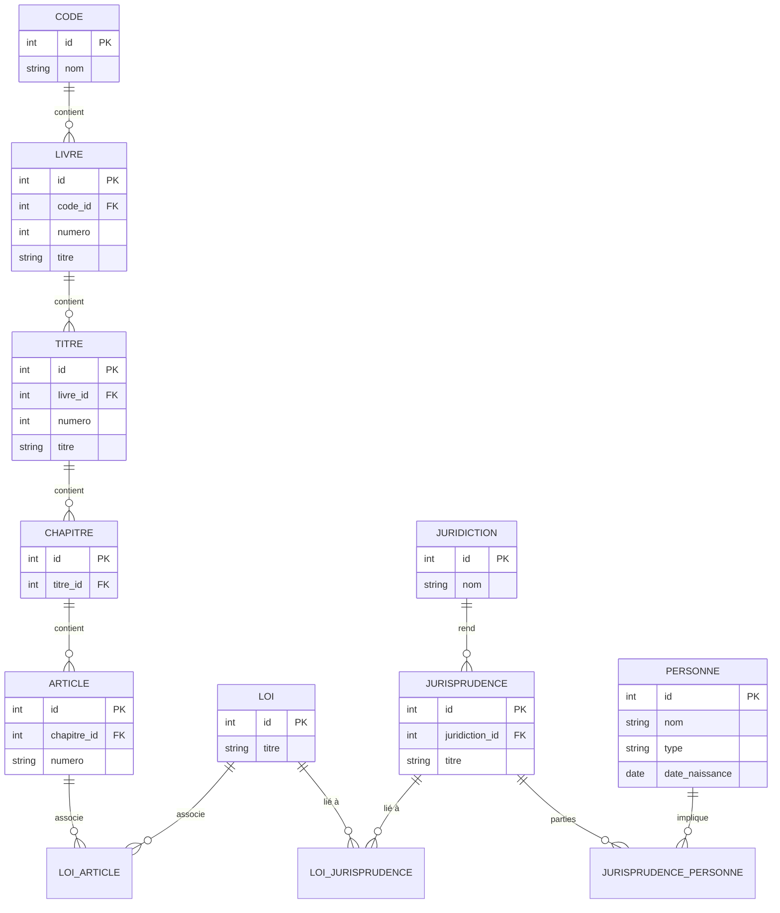

Doit permettre de gérer les différents codes lois, juridiction et jurisprudences

une table de données destinée à gérer les codes et lois, avec les champs demandés. Cette table pourra servir de base pour organiser les jurisprudences et autres informations juridiques par la suite

- Les codes, leur organisation interne 
	- livres
		- titres
			- chapitres
			- articles  
- Les lois et leur lien avec les articles.  
- Les jurisprudences, leur juridiction, les personnes impliquées, et leur lien avec les lois.  
- Les rôles des personnes dans chaque jurisprudence.




# Code

## Migration CreateCodesTable
CreateCodesTable - ( 2025-11-29 )
 
```php
use Illuminate\Database\Migrations\Migration;
use Illuminate\Database\Schema\Blueprint;
use Illuminate\Support\Facades\Schema;

class CreateCodesTable extends Migration
{
    public function up()
    {
        Schema::create('codes', function (Blueprint $table) {
            $table->id();
            $table->string('nom');
            $table->text('description')->nullable();
            $table->string('source_url')->nullable();
            $table->timestamps();
        });
    }

    public function down()
    {
        Schema::dropIfExists('codes');
    }
}
```


## Model Code
Code - ( 2025-11-29 )
 
```php
namespace App\Models;

use Illuminate\Database\Eloquent\Model;

class Code extends Model
{
    protected $primaryKey = 'id';

    protected $fillable = ['nom', 'description', 'source_url'];

    public function livres()
    {   //FK dans table livres =  code_id
        return $this->hasMany(Livre::class, 'code_id');
    }
}
```

# Livre
## Migration CreateLivresTable
CreateLivresTable - ( 2025-11-29 ) 
```php
use Illuminate\Database\Migrations\Migration;
use Illuminate\Database\Schema\Blueprint;
use Illuminate\Support\Facades\Schema;

class CreateLivresTable extends Migration
{
    public function up()
    {
        Schema::create('livres', function (Blueprint $table) {
            $table->id('id');
            $table->foreignId('code_id')->constrained('codes', 'id')->onDelete('cascade');
            $table->integer('numero');
            $table->string('titre');
            $table->text('description')->nullable();
            $table->timestamps();
        });
    }

    public function down()
    {
        Schema::dropIfExists('livres');
    }
}
```


## Model Livre
Livre - ( 2025-11-29 ) 
```php
namespace App\Models;

use Illuminate\Database\Eloquent\Model;

class Livre extends Model
{
    protected $primaryKey = 'id';

    protected $fillable = ['code_id', 'numero', 'titre', 'description'];

    public function code()
    {   // appartient a code => code (singulier )
	    // code est le parent des livres 
	    // La FK est dans ce model = code_id
        return $this->belongsTo(Code::class, 'code_id');
    }

    public function titres()
    {   // Livre = this (Parent) possede plusieurs titres  
	    // FK dans titres(enfant) = livre_id
        return $this->hasMany(Titre::class, 'livre_id');
    }
}
```
# Titre
## Migration CreateTitresTable
CreateTitresTable - ( 2025-11-29 ) 
```php
use Illuminate\Database\Migrations\Migration;
use Illuminate\Database\Schema\Blueprint;
use Illuminate\Support\Facades\Schema;

class CreateTitresTable extends Migration
{
    public function up()
    {
        Schema::create('titres', function (Blueprint $table) {
            $table->id();
            $table->foreignId('livre_id')->constrained('livres', 'id')->onDelete('cascade');
            $table->integer('numero');
            $table->string('titre');
            $table->text('description')->nullable();
            $table->timestamps();
        });
    }

    public function down()
    {
        Schema::dropIfExists('titres');
    }
}
```
## Model Titre
Titre - ( 2025-11-29 ) 
```php
namespace App\Models;

use Illuminate\Database\Eloquent\Model;

class Titre extends Model
{
    protected $primaryKey = 'id';

    protected $fillable = ['livre_id', 'numero', 'titre', 'description'];

    public function livre()
    {   // appartient a Livre , FK dans this model = livre_id
        return $this->belongsTo(Livre::class, 'livre_id');
    }

    public function chapitres()
    {   // Titre = this (Parent) a plusieurs Chapitre 
	    // FK dans chapitres (enfats) = titre_id
        return $this->hasMany(Chapitre::class, 'titre_id');
    }
}
```
# Chapitre
## Migration Chapitre
Chapitre - ( 2025-11-29 ) 
```php
use Illuminate\Database\Migrations\Migration;
use Illuminate\Database\Schema\Blueprint;
use Illuminate\Support\Facades\Schema;

class CreateChapitresTable extends Migration
{
    public function up()
    {
        Schema::create('chapitres', function (Blueprint $table) {
            $table->id();
            $table->foreignId('titre_id')->constrained('titres', 'id')->onDelete('cascade');
            $table->integer('numero');
            $table->string('titre');
            $table->text('description')->nullable();
            $table->timestamps();
        });
    }

    public function down()
    {
        Schema::dropIfExists('chapitres');
    }
}
```
## Model Chapitre
Chapitre - ( 2025-11-29 )
```php
namespace App\Models;

use Illuminate\Database\Eloquent\Model;

class Chapitre extends Model
{
    protected $primaryKey = 'id';

    protected $fillable = ['titre_id', 'numero', 'titre', 'description'];

    public function titre()
    {   // appartient a Titre , FK dans this model = titre_id
        return $this->belongsTo(Titre::class, 'titre_id');
    }

    public function articles()
    {    // Chapitre = this (Parent) a plusieurs Article 
	    //FK dans articles = chapitre_id
        return $this->hasMany(Article::class, 'chapitre_id');
    }
}
```
# Article
## Migration CreateArticlesTable
CreateArticlesTable - ( 2025-11-29 )
```php
use Illuminate\Database\Migrations\Migration;
use Illuminate\Database\Schema\Blueprint;
use Illuminate\Support\Facades\Schema;

class CreateArticlesTable extends Migration
{
    public function up()
    {
        Schema::create('articles', function (Blueprint $table) {
            $table->id();
            $table->foreignId('chapitre_id')->constrained('chapitres', 'id')->onDelete('cascade');
            $table->string('numero', 50);
            $table->longText('contenu');
            $table->date('date_modification')->nullable();
            $table->string('source_url')->nullable();
            $table->timestamps();
        });
    }

    public function down()
    {
        Schema::dropIfExists('articles');
    }
}
```
## Model Article
Article - ( 2025-11-29 )
```php
namespace App\Models;

use Illuminate\Database\Eloquent\Model;

class Article extends Model
{
    protected $primaryKey = 'id';

    protected $fillable = ['chapitre_id', 'numero', 'contenu', 'date_modification', 'source_url'];

    public function chapitre()
    {   // appartient a Chapitre , FK dans this model = chapitre_id
        return $this->belongsTo(Chapitre::class, 'chapitre_id');
    }

    public function lois()
    {  
        return $this->belongsToMany(Loi::class, 'loi_articles', 'article_id', 'loi_id');
    }
}
```
# Loi
## Model CreateLoisTable
CreateLoisTable - ( 2025-11-29 )
```php
use Illuminate\Database\Migrations\Migration;
use Illuminate\Database\Schema\Blueprint;
use Illuminate\Support\Facades\Schema;

class CreateLoisTable extends Migration
{
    public function up()
    {
        Schema::create('lois', function (Blueprint $table) {
            $table->id();
            $table->string('titre');
            $table->date('date_adoption')->nullable();
            $table->text('description')->nullable();
            $table->longText('texte_complet')->nullable();
            $table->string('source_url')->nullable();
            $table->timestamps();
        });
    }

    public function down()
    {
        Schema::dropIfExists('lois');
    }
}
```
## Model Loi
Loi - ( 2025-11-29 )
```php
namespace App\Models;

use Illuminate\Database\Eloquent\Model;

class Loi extends Model
{
    protected $primaryKey = 'id';

    protected $fillable = ['titre', 'date_adoption', 'description', 'texte_complet', 'source_url'];

    public function articles()
    {
        return $this->belongsToMany(Article::class, 'loi_articles', 'loi_id', 'article_id');
    }

    public function jurisprudences()
    {
        return $this->belongsToMany(Jurisprudence::class, 'loi_jurisprudences', 'loi_id', 'jurisprudence_id');
    }
}
```


## Migration CreateLoiArticlesTable (pivot)
CreateLoiArticlesTable - ( 2025-11-29 ) ; loi_articles est une table pivot
```php
use Illuminate\Database\Migrations\Migration;
use Illuminate\Database\Schema\Blueprint;
use Illuminate\Support\Facades\Schema;

class CreateLoiArticlesTable extends Migration
{
    public function up()
    {
        Schema::create('loi_articles', function (Blueprint $table) {
            $table->foreignId('loi_id')->constrained('lois', 'id')->onDelete('cascade');
            $table->foreignId('article_id')->constrained('articles', 'id')->onDelete('cascade');
            $table->primary(['loi_id', 'article_id']);
        });
    }

    public function down()
    {
        Schema::dropIfExists('loi_articles');
    }
}
```
# Juridiction
## Migration CreateJuridictionsTable
CreateJuridictionsTable - ( 2025-11-29 )
```php
use Illuminate\Database\Migrations\Migration;
use Illuminate\Database\Schema\Blueprint;
use Illuminate\Support\Facades\Schema;

class CreateJuridictionsTable extends Migration
{
    public function up()
    {
        Schema::create('juridictions', function (Blueprint $table) {
            $table->id();
            $table->string('nom');
            $table->string('type')->nullable();
            $table->text('description')->nullable();
            $table->string('adresse')->nullable();
            $table->string('site_web')->nullable();
            $table->timestamps();
        });
    }

    public function down()
    {
        Schema::dropIfExists('juridictions');
    }
}
```

## Model Juridiction
Juridiction - ( 2025-11-29 )
```php
namespace App\Models;

use Illuminate\Database\Eloquent\Model;

class Juridiction extends Model
{
    protected $primaryKey = 'id';

    protected $fillable = ['nom', 'type', 'description', 'adresse', 'site_web'];

    public function jurisprudences()
    {
        return $this->hasMany(Jurisprudence::class, 'juridiction_id');
    }
}
```
# Jurisprudence

## Migration CreateJurisprudences
CreateJurisprudences - ( 2025-11-29 )
```php
use Illuminate\Database\Migrations\Migration;
use Illuminate\Database\Schema\Blueprint;
use Illuminate\Support\Facades\Schema;

class CreateJurisprudencesTable extends Migration
{
    public function up()
    {
        Schema::create('jurisprudences', function (Blueprint $table) {
            $table->id();
            $table->string('titre');
            $table->date('date_decision')->nullable();
            $table->text('description')->nullable();
            $table->longText('texte_complet')->nullable();
            $table->string('source_url')->nullable();
            $table->foreignId('juridiction_id')->constrained('juridictions', 'id')->onDelete('cascade');
            $table->timestamps();
        });
    }

    public function down()
    {
        Schema::dropIfExists('jurisprudences');
    }
}
```

## Model Jurisprudence
Jurisprudence - ( 2025-11-29 )
```php
namespace App\Models;

use Illuminate\Database\Eloquent\Model;

class Jurisprudence extends Model
{
    protected $primaryKey = 'id';

    protected $fillable = ['titre', 'date_decision', 'description', 'texte_complet', 'source_url', 'juridiction_id'];

    public function juridiction()
    {
        return $this->belongsTo(Juridiction::class, 'juridiction_id');
    }

    public function personnes()
    {
        return $this->belongsToMany(Personne::class, 'jurisprudence_personnes', 'jurisprudence_id', 'personne_id')->withPivot('role');
    }

    public function lois()
    {
        return $this->belongsToMany(Loi::class, 'loi_jurisprudences', 'jurisprudence_id', 'loi_id');
    }
}
```
# Personnes

## Migration CreatePersonnesTable
CreatePersonnesTable - ( 2025-11-29 )
```php
use Illuminate\Database\Migrations\Migration;
use Illuminate\Database\Schema\Blueprint;
use Illuminate\Support\Facades\Schema;

class CreatePersonnesTable extends Migration
{
    public function up()
    {
        Schema::create('personnes', function (Blueprint $table) {
            $table->id();
            $table->string('nom');
            $table->enum('type', ['Physique', 'Morale']);
            $table->date('date_naissance')->nullable();
            $table->text('description')->nullable();
            $table->timestamps();
        });
    }

    public function down()
    {
        Schema::dropIfExists('personnes');
    }
}
```

## Model Personne
Personne - ( 2025-11-29 )
```php
namespace App\Models;  
  
use Illuminate\Database\Eloquent\Model;  
  
class Personne extends Model  
{  
    protected $primaryKey = 'id';  
  
    protected $fillable = ['nom', 'type', 'date_naissance', 'description'];  
  
    public function jurisprudences()  
    {  
        return $this->belongsToMany(Jurisprudence::class, 'jurisprudence_personnes', 'personne_id', 'jurisprudence_id')->withPivot('role');  
    }  
}
```
# Jurisprudence_Personne
## Migration CreateJurisprudencePersonnes (pivot)
CreateJurisprudencePersonnes - ( 2025-11-29 )
```php
use Illuminate\Database\Migrations\Migration;
use Illuminate\Database\Schema\Blueprint;
use Illuminate\Support\Facades\Schema;

class CreateJurisprudencePersonnesTable extends Migration
{
    public function up()
    {
        Schema::create('jurisprudence_personnes', function (Blueprint $table) {
            $table->foreignId('jurisprudence_id')->constrained('jurisprudences', 'id')->onDelete('cascade');
            $table->foreignId('personne_id')->constrained('personnes', 'id')->onDelete('cascade');
            $table->string('role')->nullable();
            $table->primary(['jurisprudence_id', 'personne_id']);
        });
    }

    public function down()
    {
        Schema::dropIfExists('jurisprudence_personnes');
    }
}
```
# Loi_Jurisprudences
## Migration CreateLoiJurisprudencesTable
CreateLoiJurisprudencesTable - ( 2025-11-29 )
```php
use Illuminate\Database\Migrations\Migration;
use Illuminate\Database\Schema\Blueprint;
use Illuminate\Support\Facades\Schema;

class CreateLoiJurisprudencesTable extends Migration
{
    public function up()
    {
        Schema::create('loi_jurisprudences', function (Blueprint $table) {
            $table->foreignId('loi_id')->constrained('lois', 'id')->onDelete('cascade');
            $table->foreignId('jurisprudence_id')->constrained('jurisprudences', 'jurisprudence_id')->onDelete('cascade');
            $table->text('commentaire')->nullable();
            $table->primary(['loi_id', 'jurisprudence_id']);
        });
    }

    public function down()
    {
        Schema::dropIfExists('loi_jurisprudences');
    }
}
```


