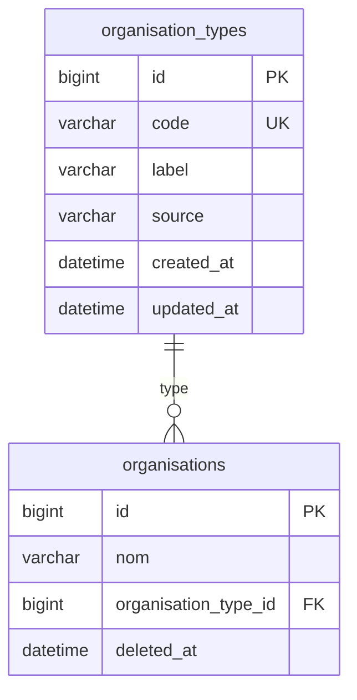

# organisation_types

> Référentiel piloté par le code — pas de création libre en UI.
> Soft delete : **NON** (option B — référentiel)
## Structure

| Field       | Type            | Null | Key | Default | Extra          |
| ----------- | --------------- | ---- | --- | ------- | -------------- |
| id          | bigint unsigned | NO   | PRI | _NULL_  | auto_increment |
| code        | varchar(50)     | NO   | UNI | _NULL_  |                |
| label       | varchar(100)    | NO   |     | _NULL_  |                |
| description | text            | YES  |     | _NULL_  |                |
| created_at  | datetime        | YES  |     | _NULL_  |                |
| updated_at  | datetime        | YES  |     | _NULL_  |                |
## Diagramme




## Données initiales (seeder)

| code | label | source |
|---|---|---|
| entreprise | Entreprise | INPI / INSEE |
| association | Association | RNA / INPI |
| institution | Institution | manuel |
| media | Média | manuel / scraping |
| parti_politique | Parti politique | Poligraph PT- |
| groupe_parlementaire | Groupe parlementaire | Poligraph GP- |
| syndicat | Syndicat | manuel |
| collectivite | Collectivité | INSEE |

## SQL migration

```sql
CREATE TABLE `organisation_types` (
  `id` bigint UNSIGNED NOT NULL,
  `code` varchar(50) COLLATE utf8mb4_unicode_ci NOT NULL,
  `label` varchar(100) COLLATE utf8mb4_unicode_ci NOT NULL,
  `description` text COLLATE utf8mb4_unicode_ci,
  `created_at` datetime DEFAULT NULL,
  `updated_at` datetime DEFAULT NULL
) ENGINE=InnoDB DEFAULT CHARSET=utf8mb4 COLLATE=utf8mb4_unicode_ci;


ALTER TABLE `organisation_types`
  ADD PRIMARY KEY (`id`),
  ADD UNIQUE KEY `code` (`code`),
  ADD KEY `idx_code` (`code`);


ALTER TABLE `organisation_types`
  MODIFY `id` bigint UNSIGNED NOT NULL AUTO_INCREMENT;
COMMIT;


INSERT INTO `organisation_types` VALUES
(1, 'ENTREPRISE', 'Entreprise', 'Société commerciale, artisan, indépendant', NULL, NULL),
(2, 'ASSOCIATION', 'Association loi 1901', 'Association déclarée en préfecture', NULL, NULL),
(3, 'COOPERATIVE', 'Coopérative', 'SCOP, SCIC, coopérative agricole…', NULL, NULL),
(4, 'ETAB_PUBLIC', 'Établissement public', 'EPIC, EPA, hôpital…', NULL, NULL),
(5, 'ETAB_SCOLAIRE', 'Établissement scolaire', 'Lycée, collège, école', NULL, NULL),
(6, 'COLLECTIVITE', 'Collectivité territoriale', 'Commune, département, région', NULL, NULL),
(7, 'MUSEE', 'Musée / Site culturel', 'Musée, site patrimonial', NULL, NULL);
```

SHOW COLUMNS FROM organisation_types;

| Field       | Type            | Null | Key | Default | Extra          |
| ----------- | --------------- | ---- | --- | ------- | -------------- |
| id          | bigint unsigned | NO   | PRI | _NULL_  | auto_increment |
| code        | varchar(50)     | NO   | UNI | _NULL_  |                |
| label       | varchar(100)    | NO   |     | _NULL_  |                |
| description | text            | YES  |     | _NULL_  |                |
| created_at  | datetime        | YES  |     | _NULL_  |                |
| updated_at  | datetime        | YES  |     | _NULL_  |                |

SHOW INDEX FROM organisation_types;

| Table              | Non_unique | Key_name | Seq_in_index | Column_name | Collation | Cardinality | Sub_part | Packed | Null | Index_type | Comment | Index_comment | Visible | Expression |
| ------------------ | ---------- | -------- | ------------ | ----------- | --------- | ----------- | -------- | ------ | ---- | ---------- | ------- | ------------- | ------- | ---------- |
| organisation_types | 0          | PRIMARY  | 1            | id          | A         | 7           | _NULL_   | _NULL_ |      | BTREE      |         |               | YES     | _NULL_     |
| organisation_types | 0          | code     | 1            | code        | A         | 7           | _NULL_   | _NULL_ |      | BTREE      |         |               | YES     | _NULL_     |
| organisation_types | 1          | idx_code | 1            | code        | A         | 7           | _NULL_   | _NULL_ |      | BTREE      |         |               | YES     | _NULL_     |

| [id] | [code]        | [label]                   | [description]                             | [created_at] | [updated_at] |
| ---- | ------------- | ------------------------- | ----------------------------------------- | ------------ | ------------ |
| 1    | ENTREPRISE    | Entreprise                | Société commerciale, artisan, indépendant | _NULL_       | _NULL_       |
| 2    | ASSOCIATION   | Association loi 1901      | Association déclarée en préfecture        | _NULL_       | _NULL_       |
| 3    | COOPERATIVE   | Coopérative               | SCOP, SCIC, coopérative agricole…         | _NULL_       | _NULL_       |
| 4    | ETAB_PUBLIC   | Établissement public      | EPIC, EPA, hôpital…                       | _NULL_       | _NULL_       |
| 5    | ETAB_SCOLAIRE | Établissement scolaire    | Lycée, collège, école                     | _NULL_       | _NULL_       |
| 6    | COLLECTIVITE  | Collectivité territoriale | Commune, département, région              | _NULL_       | _NULL_       |
| 7    | MUSEE         | Musée / Site culturel     | Musée, site patrimonial                   | _NULL_       | _NULL_       |


## Notes

- `code` : clé métier stable — utilisée dans le code Python (`"entreprise"`, `"parti_politique"`...)
- `id` : clé technique pour les FK dans `organisations`
- Pas de soft delete — une suppression ici est une erreur de modèle
- `source` : indique quelle API alimente ce type (documentation uniquement)
- Lien Poligraph : `parti_politique` → `PT-xxxxxx`, `groupe_parlementaire` → `GP-xxxxxx`
```
