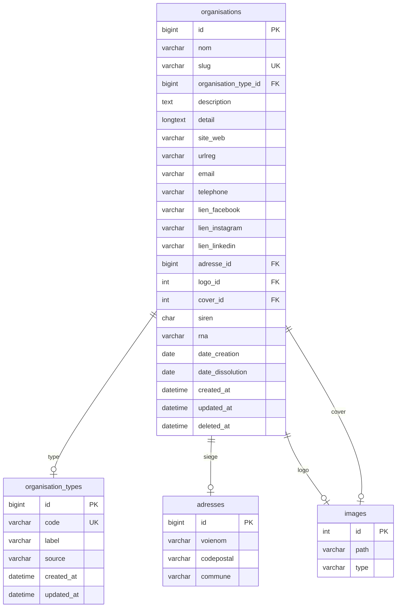

# Organisations

## Modification

#### 2026-07-05 : table : organisations 
+ actif BOOLEAN NOT NULL DEFAULT TRUE,
+ tva_intracom VARCHAR(20) NULL,

## Note

| Identifiant | Concerne | Exemple |
| --- | --- | --- |
| SIREN	|L'organisation (personne morale) |	552 100 554|
| SIRET	|Un établissement |	55210055400013 |
| TVA intracommunautaire|	Assujettissement TVA | FR40552100554 |
| RNA |	Associations loi 1901 |	W751234567 |

---

urlreg : lien annuaire institutionnel (INPI, RNA...)
deleted_at : soft delete via CI SoftDeleteTrait

### Images pich / picl
Pas de colonne VARCHAR pour les URLs, on passe par le module images existant, cohérence garantie.
logo_id  : FK → images.id - picl : logo
cover_id : FK → images.id - pich : grande image / photo HQ

### Tables liés

**organisation_types**
une organisation : Parti Socialiste est un parti politique 

PS ou Parti Socialiste 
=> **organisation_alias** ; une organisation peut avoir un **sigle**

**organisation_relations**
une organisation : Parti Socialiste  **membre** de l'organisation NUPES
organisation Association X **financée par** organisation Fondation Y
Entreprise A ( héritage organisation ) **filiale de** Holding B ( héritage organisation )


## Requis

Pour enregistrer une organisation il faut résoudre : 
	- codenaf_id via : GET /codesnaf/{naf}
	- forme_juridique_id via : GET /formejuridique/{code}

## Structure

```sql
SHOW COLUMNS FROM organisations;
SHOW INDEX FROM organisations;
```

## SQL

```sql

```

---

## Backend

### Routes
```
// Routes (groupe 'api') :
//   $routes->get   ('organisation',        'Organisation::index');
//   $routes->get   ('organisation/like',   'Organisation::like');
//   $routes->get   ('organisation/(:num)', 'Organisation::show/$1');
//   $routes->post  ('organisation',        'Organisation::create');
//   $routes->put   ('organisation/(:num)', 'Organisation::update/$1');
//   $routes->delete('organisation/(:num)', 'Organisation::delete/$1');
```

### app/Models/OrganisationModel.php
use App\Models\OrganisationModel;
use App\Traits\ApiResponse;
use CodeIgniter\RESTful\ResourceController;

#### soft delete
```php
	// $routes->delete('organisation/(:num)', 'Organisation::delete/$1');
    // DELETE /api/organisation/:id  (soft delete)
    
    public function delete($id = null)
    {
        $model = $this->getModel();
        if (! $model->find((int) $id)) {
            return $this->apiNotFound("Organisation #{$id} introuvable.");
        }
        $model->delete((int) $id);
        return $this->apiDeleted("Organisation #{$id} supprimée.");
    }
```

---

## Front JS

\assets\js\features\organisation\index.js
\assets\js\features\organisation\organisation.controller.js
\assets\js\features\organisation\organisation.form.js
\assets\js\features\organisation\organisation.renderer.js
\assets\js\features\organisation\organisation.service.js
\assets\js\features\organisation\organisation.store.js

---

## Diagramme




