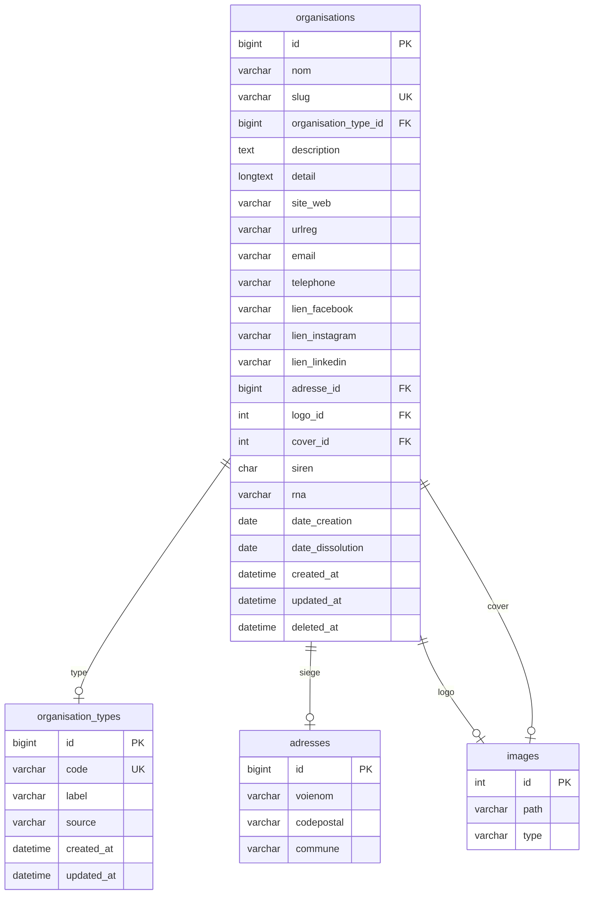

# Organisations

## Modification

#### 2026-07-05 : table : organisations 
+ actif BOOLEAN NOT NULL DEFAULT TRUE,
+ tva_intracom VARCHAR(20) NULL,


- [ ] modifier back et front end

## Note

| Identifiant | Concerne | Exemple |
| --- | --- | --- |
| SIREN	|L'organisation (personne morale) |	552 100 554|
| SIRET	|Un établissement |	55210055400013 |
| TVA intracommunautaire|	Assujettissement TVA | FR40552100554 |
| RNA |	Associations loi 1901 |	W751234567 |

---

urlreg : lien annuaire institutionnel (INPI, RNA...)
deleted_at : soft delete via CI SoftDeleteTrait

### Images pich / picl
Pas de colonne VARCHAR pour les URLs, on passe par le module images existant, cohérence garantie.
logo_id  : FK → images.id - picl : logo
cover_id : FK → images.id - pich : grande image / photo HQ

### Tables liés

**organisation_types**
une organisation : Parti Socialiste est un parti politique 

PS ou Parti Socialiste 
=> **organisation_alias** ; une organisation peut avoir un **sigle**

**organisation_relations**
une organisation : Parti Socialiste  **membre** de l'organisation NUPES
organisation Association X **financée par** organisation Fondation Y
Entreprise A ( héritage organisation ) **filiale de** Holding B ( héritage organisation )


## Requis

Pour enregistrer une organisation il faut résoudre : 
	- codenaf_id via : GET /codesnaf/{naf}
	- forme_juridique_id via : GET /formejuridique/{code}

## Structure

```sql
SHOW COLUMNS FROM organisations;
SHOW INDEX FROM organisations;
```


| Field                | Type            | Null | Key | Default | Extra          |
| -------------------- | --------------- | ---- | --- | ------- | -------------- |
| id                   | bigint unsigned | NO   | PRI | _NULL_  | auto_increment |
| nom                  | varchar(255)    | NO   | MUL | _NULL_  |                |
| slug                 | varchar(255)    | YES  | UNI | _NULL_  |                |
| organisation_type_id | bigint unsigned | YES  | MUL | _NULL_  |                |
| description          | text            | YES  |     | _NULL_  |                |
| detail               | longtext        | YES  |     | _NULL_  |                |
| site_web             | varchar(255)    | YES  |     | _NULL_  |                |
| urlreg               | varchar(255)    | YES  |     | _NULL_  |                |
| email                | varchar(255)    | YES  |     | _NULL_  |                |
| telephone            | varchar(50)     | YES  |     | _NULL_  |                |
| lien_facebook        | varchar(255)    | YES  |     | _NULL_  |                |
| lien_instagram       | varchar(255)    | YES  |     | _NULL_  |                |
| lien_linkedin        | varchar(255)    | YES  |     | _NULL_  |                |
| adresse_id           | bigint unsigned | YES  | MUL | _NULL_  |                |
| logo_id              | int unsigned    | YES  | MUL | _NULL_  |                |
| cover_id             | int unsigned    | YES  | MUL | _NULL_  |                |
| siren                | char(9)         | YES  | MUL | _NULL_  |                |
| tva_intracom         | varchar(20)     | YES  |     | _NULL_  |                |
| actif                | tinyint(1)      | NO   |     | 1       |                |
| rna                  | varchar(20)     | YES  |     | _NULL_  |                |
| date_creation        | date            | YES  |     | _NULL_  |                |
| date_dissolution     | date            | YES  |     | _NULL_  |                |
| created_at           | datetime        | YES  |     | _NULL_  |                |
| updated_at           | datetime        | YES  |     | _NULL_  |                |
| deleted_at           | datetime        | YES  |     | _NULL_  |                |


## SQL

```sql
CREATE TABLE `organisations` (
  `id` bigint UNSIGNED NOT NULL,
  `nom` varchar(255) COLLATE utf8mb4_unicode_ci NOT NULL,
  `slug` varchar(255) COLLATE utf8mb4_unicode_ci DEFAULT NULL,
  `organisation_type_id` bigint UNSIGNED DEFAULT NULL,
  `description` text COLLATE utf8mb4_unicode_ci,
  `detail` longtext COLLATE utf8mb4_unicode_ci,
  `site_web` varchar(255) COLLATE utf8mb4_unicode_ci DEFAULT NULL,
  `urlreg` varchar(255) COLLATE utf8mb4_unicode_ci DEFAULT NULL COMMENT 'Lien annuaire institutionnel',
  `email` varchar(255) COLLATE utf8mb4_unicode_ci DEFAULT NULL,
  `telephone` varchar(50) COLLATE utf8mb4_unicode_ci DEFAULT NULL,
  `lien_facebook` varchar(255) COLLATE utf8mb4_unicode_ci DEFAULT NULL,
  `lien_instagram` varchar(255) COLLATE utf8mb4_unicode_ci DEFAULT NULL,
  `lien_linkedin` varchar(255) COLLATE utf8mb4_unicode_ci DEFAULT NULL,
  `adresse_id` bigint UNSIGNED DEFAULT NULL COMMENT 'FK → adresses.id',
  `logo_id` int UNSIGNED DEFAULT NULL COMMENT 'FK → images.id (picl)',
  `cover_id` int UNSIGNED DEFAULT NULL COMMENT 'FK → images.id (pich)',
  `siren` char(9) COLLATE utf8mb4_unicode_ci DEFAULT NULL,
  `tva_intracom` varchar(20) COLLATE utf8mb4_unicode_ci DEFAULT NULL,
  `actif` tinyint(1) NOT NULL DEFAULT '1',
  `rna` varchar(20) COLLATE utf8mb4_unicode_ci DEFAULT NULL,
  `date_creation` date DEFAULT NULL,
  `date_dissolution` date DEFAULT NULL,
  `created_at` datetime DEFAULT NULL,
  `updated_at` datetime DEFAULT NULL,
  `deleted_at` datetime DEFAULT NULL
) ENGINE=InnoDB DEFAULT CHARSET=utf8mb4 COLLATE=utf8mb4_unicode_ci COMMENT='Table mère — entreprises, associations, établissements scolaires…';

-- Index pour la table `organisations`
ALTER TABLE `organisations`
  ADD PRIMARY KEY (`id`),
  ADD UNIQUE KEY `slug` (`slug`),
  ADD KEY `idx_nom` (`nom`(100)),
  ADD KEY `idx_slug` (`slug`),
  ADD KEY `idx_siren` (`siren`),
  ADD KEY `idx_type` (`organisation_type_id`),
  ADD KEY `fk_org_adresse` (`adresse_id`),
  ADD KEY `fk_org_logo` (`logo_id`),
  ADD KEY `fk_org_cover` (`cover_id`);

-- AUTO_INCREMENT pour la table `organisations`
ALTER TABLE `organisations` MODIFY `id` bigint UNSIGNED NOT NULL AUTO_INCREMENT;

-- Contraintes pour la table `organisations`
ALTER TABLE `organisations`
  ADD CONSTRAINT `fk_org_adresse` FOREIGN KEY (`adresse_id`) REFERENCES `adresses` (`id`) ON DELETE SET NULL,
  ADD CONSTRAINT `fk_org_cover` FOREIGN KEY (`cover_id`) REFERENCES `images` (`id`) ON DELETE SET NULL,
  ADD CONSTRAINT `fk_org_logo` FOREIGN KEY (`logo_id`) REFERENCES `images` (`id`) ON DELETE SET NULL,
  ADD CONSTRAINT `fk_org_type` FOREIGN KEY (`organisation_type_id`) REFERENCES `organisation_types` (`id`) ON DELETE SET NULL;
COMMIT;
```

---

## Backend

### Routes
```
// Routes (groupe 'api') :
//   $routes->get   ('organisation',        'Organisation::index');
//   $routes->get   ('organisation/like',   'Organisation::like');
//   $routes->get   ('organisation/(:num)', 'Organisation::show/$1');
//   $routes->post  ('organisation',        'Organisation::create');
//   $routes->put   ('organisation/(:num)', 'Organisation::update/$1');
//   $routes->delete('organisation/(:num)', 'Organisation::delete/$1');
```

### app/Models/OrganisationModel.php
use App\Models\OrganisationModel;
use App\Traits\ApiResponse;
use CodeIgniter\RESTful\ResourceController;

#### soft delete
```php
	// $routes->delete('organisation/(:num)', 'Organisation::delete/$1');
    // DELETE /api/organisation/:id  (soft delete)
    
    public function delete($id = null)
    {
        $model = $this->getModel();
        if (! $model->find((int) $id)) {
            return $this->apiNotFound("Organisation #{$id} introuvable.");
        }
        $model->delete((int) $id);
        return $this->apiDeleted("Organisation #{$id} supprimée.");
    }
```

---

## Front JS

\assets\js\features\organisation\index.js
\assets\js\features\organisation\organisation.controller.js
\assets\js\features\organisation\organisation.form.js
\assets\js\features\organisation\organisation.renderer.js
\assets\js\features\organisation\organisation.service.js
\assets\js\features\organisation\organisation.store.js

---

## Diagramme




