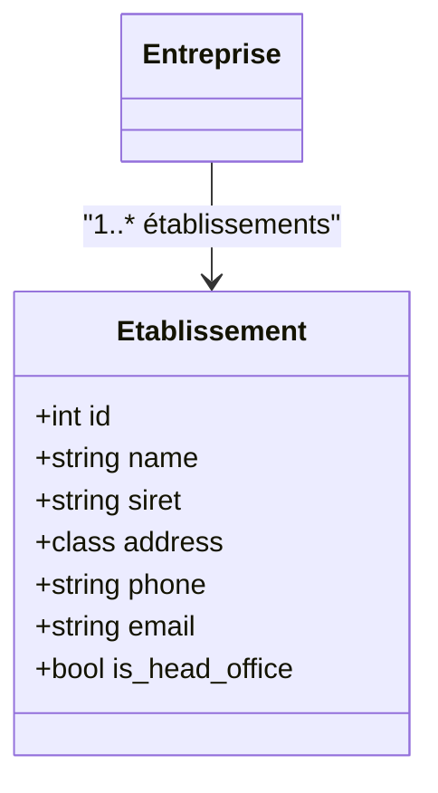

# METIERS

## Economie

### Organisation
Une Organisation est la classe principale elle 

### Entreprises

### Etablissements
Les **Etablissement**, dont le siège social, ont chacun :
- un **SIRET** différent
-  un code **NIC**
-  une **Adresse** propre

### Services (d'entreprise)
==a distinguer des prestations (de service)==

- un **service entreprise** est un **service** d'une **entreprise**
- Les **services** sont composés de **salariés** qui ont  des **fonctions**
- un **service** direction est présent dans plusieurs **Entreprise** 
- un **service entreprise** à un parent service d'entreprise (relation hiérarchique ), les relations hiérarchiques sont propre a chaque **entreprise**

---
## CMS

---
## Knowledge Management
