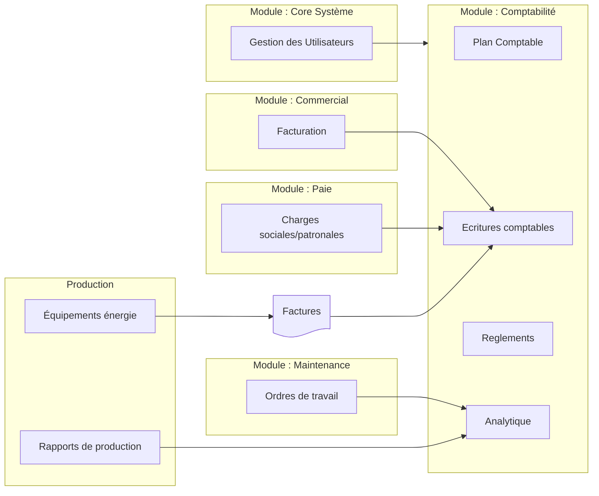
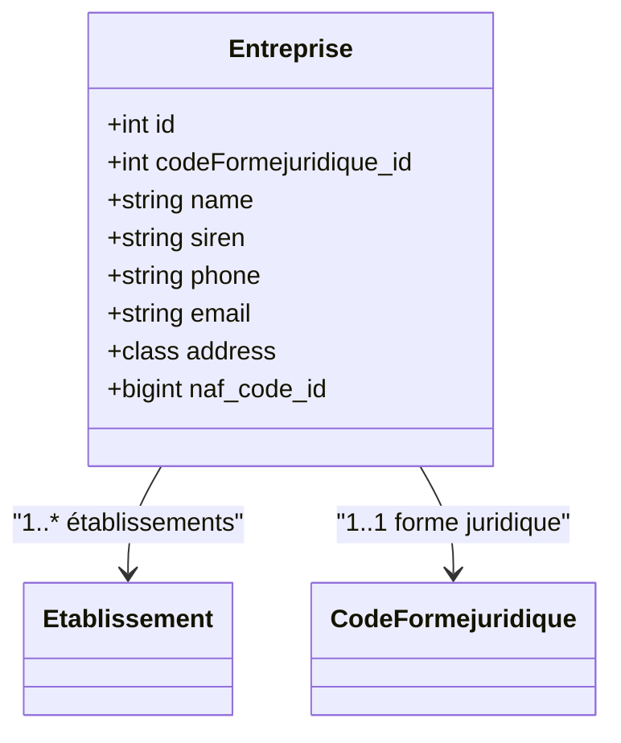
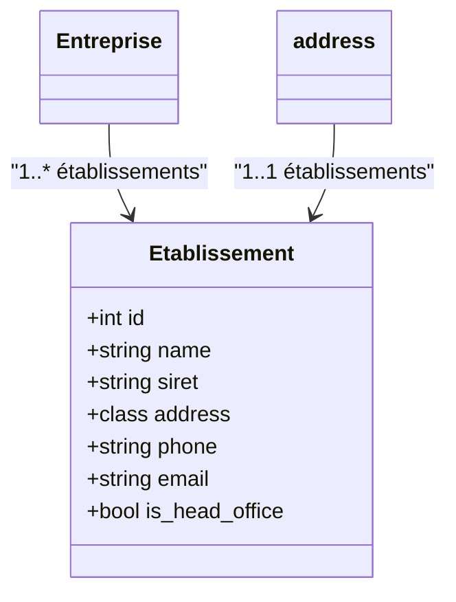

# METIERS

Interaction entre les modules



## Economie

### comptabilité

  ```mermaid
  flowchart LR
    %% ================================
    %%        COMPTABILITE
    %% ================================
    subgraph COMPTA[Module : Comptabilité]
        PLANPCG[Plan Comptable]
        ECRITURES[Ecritures comptables]
        REGLEMENT[Reglements]
        ANALYTIQUE[Analytique]
    end
  ```


### Organisation
Une Organisation est la classe principale elle 


### Entreprises
 - une **Entreprise** et un Etablissement ont la même **forme juridique** ? OUI 
- requête sur **siret** ou **siren** (Siret peut être modifié en cas de déménagement )
- siren sert d'id ?
- Numéro de sécurité sociale
	👤 Identifiants entrepreneurs individuels / micro-entreprises
	Pour les entrepreneurs individuels : utilisé pour les contributions personnelles (pas un identifiant public de l’entreprise, mais lié).
- N° de gestion INPI pour EI protégée
	Pour protéger le nom et distinguer les activités de la personne physique.
- Numéro d’agrément ou licence sectorielle selon le métier :
		transport (licence transport)
		sécurité (autorisation CNAPS)
		agences de voyage
		agroalimentaire
		sanitaire, social, médical
		BTP (numéro Qualibat, RGE…)
- Marques et protections
- Numéro de dépôt de marque (INPI)
		Si l’entreprise a déposé une marque.
- Numéro de brevet / modèle
		Déposés à l’INPI.




### Etablissements
Les **Etablissement**, dont le siège social, ont chacun :
- un **SIRET** différent
-  un code **NIC**
-  une **Adresse** propre et unique (le module adresse permet cette distinction)



### Services (d'entreprise)
==a distinguer des prestations (de service)==

- un **service entreprise** est un **service** d'une **entreprise**
- Les **services** sont composés de **salariés** qui ont  des **fonctions**
- un **service** direction est présent dans plusieurs **Entreprise** 
- un **service entreprise** à un parent service d'entreprise (relation hiérarchique ), les relations hiérarchiques sont propre a chaque **entreprise**

## Evolutions
### activites_etablissement (pivot)
Les **activites_etablissement** (pivot)
- aeEtab_id -> ( etablissement->entreprise_id ) -> entreprise.id
- aeAct_id -> naf.id ->  activites du referentiel insee
- aeNom -> appellation interne de l'activité
  

---
## CMS

---
## Knowledge Management
