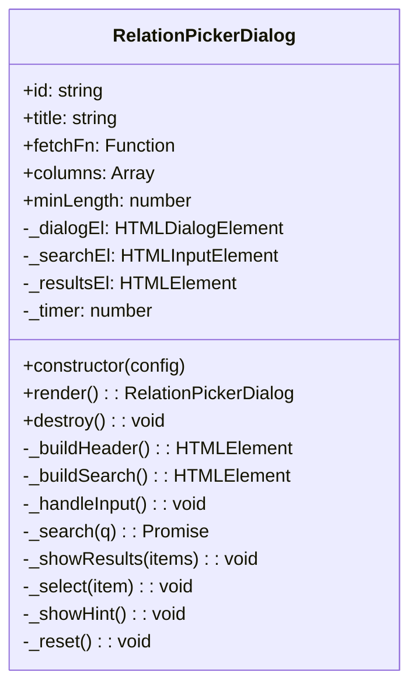
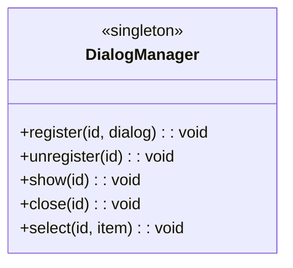
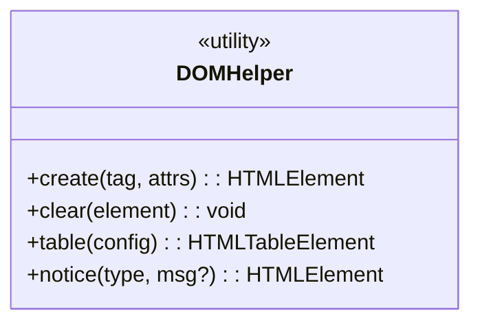

| diagramme | code |
| --------- | ---- |
| DialogManager | ```  |
| DOMHelper | ```  |
| RelationPickerDialog | ```  |


### RelationPickerDialog

#### RelationPickerDialog - diagramme


#### RelationPickerDialog - code
```
classDiagram
    class RelationPickerDialog {
        +id: string
        +title: string
        +fetchFn: Function
        +columns: Array
        +minLength: number
        -_dialogEl: HTMLDialogElement
        -_searchEl: HTMLInputElement
        -_resultsEl: HTMLElement
        -_timer: number
        +constructor(config)
        +render(): RelationPickerDialog
        +destroy(): void
        -_buildHeader(): HTMLElement
        -_buildSearch(): HTMLElement
        -_handleInput(): void
        -_search(q): Promise
        -_showResults(items): void
        -_select(item): void
        -_showHint(): void
        -_reset(): void
    }
```

### DialogManager

#### DialogManager - diagramme

#### DialogManager - code
```
classDiagram
    class DialogManager {
        <<singleton>>
        +register(id, dialog): void
        +unregister(id): void
        +show(id): void
        +close(id): void
        +select(id, item): void
    }
```

### DOMHelper
#### DOMHelper - diagramme

#### DOMHelper - code
```
classDiagram
    class DOMHelper {
        <<utility>>
        +create(tag, attrs): HTMLElement
        +clear(element): void
        +table(config): HTMLTableElement
        +notice(type, msg?): HTMLElement
    }
```


