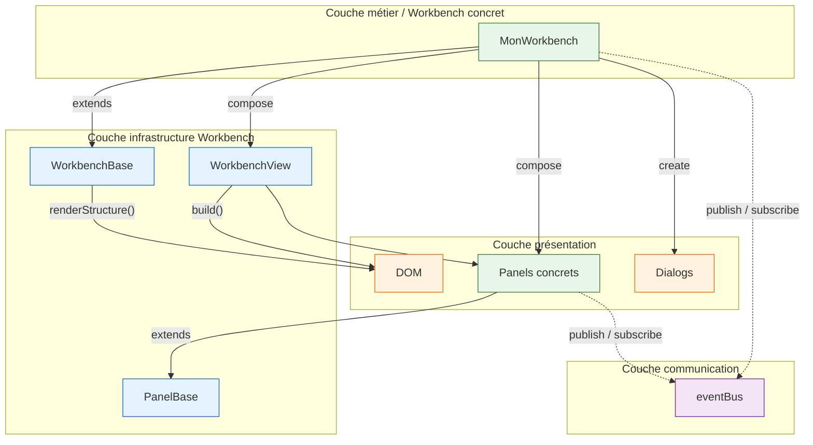

```mermaid
flowchart TB

    subgraph APP["Couche métier / Workbench concret"]
        MW["MonWorkbench"]
    end

    subgraph CORE["Couche infrastructure Workbench"]
        WB["WorkbenchBase"]
        WV["WorkbenchView"]
        PB["PanelBase"]
    end

    subgraph UI["Couche présentation"]
        DOM["DOM"]
        DLG["Dialogs"]
        PAN["Panels concrets"]
    end

    subgraph BUS["Couche communication"]
        BUSOBJ["eventBus"]
    end

    MW -->|"extends"| WB
    MW -->|"compose"| WV
    MW -->|"compose"| PAN

    PAN -->|"extends"| PB

    WB -->|"renderStructure()"| DOM
    WV -->|"build()"| DOM
    MW -->|"create"| DLG

    MW -.->|"publish / subscribe"| BUSOBJ
    PAN -.->|"publish / subscribe"| BUSOBJ

    WV --> PAN

    classDef concrete fill:#e8f5e9,stroke:#2e7d32
    classDef infrastructure fill:#e3f2fd,stroke:#1565c0
    classDef presentation fill:#fff3e0,stroke:#ef6c00
    classDef communication fill:#f3e5f5,stroke:#7b1fa2

    class MW,PAN concrete
    class WB,WV,PB infrastructure
    class DOM,DLG presentation
    class BUSOBJ communication
```
