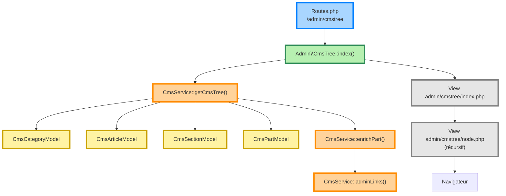

Pour les couleurs 
des classes de stylesseront plus facile a réemployer
```
style A fill:#bbf,stroke:#f66,stroke-width:2px,color:#fff,stroke-dasharray: 5 5

// definit la classe classRoutes
classDef classRoutes fill:#f9f,stroke:#333,stroke-width:4px;
//afecte la classe classRoutes au noeud A
class A className;

// une autre ectriure plus codensée
A:::classRoutes --> B
classDef classRoutes fill:#f9f,stroke:#333,stroke-width:4px;
```
il faut employer stroke et fill

- fill 
Routes             bleu
Controller         vert
CmsService         orange
Models             jaune
Descriptor         violet
Renderers          rouge
Views              gris

- stroke indique un état : on peut employer stroke-width et stroke-dasharray: 5 5

## style
- Implémenté, utilisé en production : vert,stroke-width:4px    
- Utilisé mais sans documentation : jaune,stroke-width:2px   
bleu,stroke-width:2px Fonctionnel mais évolutif
violet,stroke-width:1px  Expérimentation conservée
blanc,stroke-width:1px,stroke-dasharray: 5 5   Conception future uniquement
rouge,stroke-width:2px,stroke-dasharray: 5 5   Plus utilisé

---




```
flowchart TD

classDef routes fill:#A9D6FF,stroke:#0080FF,stroke-width:4px;
classDef controller fill:#B7F0B1,stroke:#2E8B57,stroke-width:4px;
classDef service fill:#FFD39B,stroke:#FF8C00,stroke-width:4px;
classDef model fill:#FFF3A3,stroke:#C9A000,stroke-width:4px;
classDef view fill:#E6E6E6,stroke:#808080,stroke-width:4px;

A["Routes.php<br/>/admin/cmstree"]:::routes
A --> B["Admin\\CmsTree::index()"]:::controller

B --> C["CmsService::getCmsTree()"]:::service

C --> D["CmsCategoryModel"]:::model
C --> E["CmsArticleModel"]:::model
C --> F["CmsSectionModel"]:::model
C --> G["CmsPartModel"]:::model

C --> H["CmsService::enrichPart()"]:::service
H --> I["CmsService::adminLinks()"]:::service

B --> J["View admin/cmstree/index.php"]:::view

J --> K["View admin/cmstree/node.php<br/>(récursif)"]:::view

K --> L["Navigateur"]
```


une évolution : ajouter, dans tous les diagrammes internes, une distinction entre flux d'appels et flux de données. Par exemple :

flèches pleines (-->) : appels de méthodes ;

flèches pointillées (-.->) : objets ou collections retournés (Category[], Article[], Section[], Part[], DescriptorDefinition, etc.).

Cela rendrait les diagrammes plus proches de diagrammes d'architecture qu'un simple organigramme d'exécution, tout en restant compatibles avec Mermaid.
