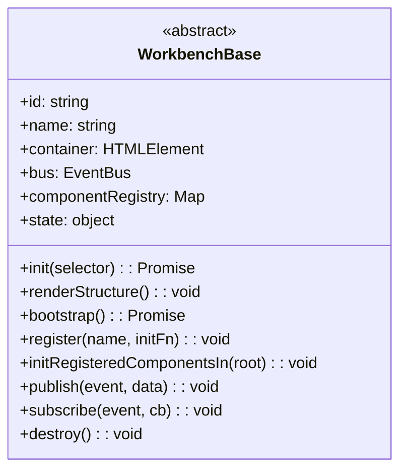

# WorkbenchBase

Base commune de tous les Workbenches.

Responsabilités :
- accès au container DOM via init()
- accès au bus d'événements via this.bus
- sélection d'éléments via getElement()
- points d'entrée du cycle de vie : bootstrap(), load(), destroy()

Ce que WorkbenchBase ne fait PAS :
- aucune construction de layout
- aucune gestion de Panel
- aucun enregistrement de composant
- aucun template
- aucun appel API
