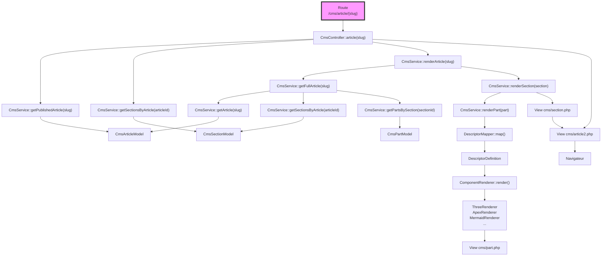

revoir l'organisation de documentation/ARCHITECTURE
Ajouter un diagramme de flux d'appels dans  documentation/ARCHITECTURE/FLOWS


## revoir l'organisation de documentation/ARCHITECTURE

la liste des fichiers : ---

structurer le dossier ainsi :

```
documentation/
└── ARCHITECTURE/
    ├── OVERVIEW/
    │   ├── ARCHITECTURE-OVERVIEW.md
    │   └── DECISIONS.md
    │
    ├── BACKEND/
    │   ├── CmsController.md
    │   ├── CmsService.md
    │   ├── Routes.md
    │   └── ...
    │
    ├── COMPONENTS/
    │   ├── DescriptorDefinition.md
    │   ├── DescriptorMapper.md
    │   ├── ComponentRenderer.md
    │   └── ...
    │
    ├── FLOWS/
    │   ├── article-rendering.md
    │   ├── descriptor-pipeline.md
    │   ├── component-rendering.md
    │   └── admin-tree.md
    │
    └── DEFINITIONS/
        ├── EntityDefinition.md
        ├── FieldDefinition.md
        └── RelationDefinition.md
```


documentation/
```
ARCHITECTURE/
│
├── ARCHITECTURE-OVERVIEW.md      ← vue d'ensemble
│
├── BACKEND/                      ← documentation des classes
├── COMPONENTS/
├── FLOWS/                        ← diagrammes d'exécution
├── DECISIONS/                    ← choix validés
│
└── ROADMAP/                      ← architecture cible
```
Cette séparation correspond très bien à votre manière de travailler :

BACKEND répond à « Comment fonctionne cette classe ? ».

FLOWS répond à « Comment circule une requête ou un rendu ? ».

DECISIONS répond à « Pourquoi cette architecture a-t-elle été choisie ? ».

ROADMAP répond à « Où voulons-nous aller ? ».


##  diagramme de flux d'appels




