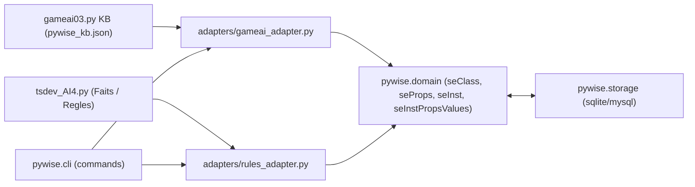

# Concept

# Implementation

[`knowledge_base`](project/sysex/gameai-0-5/gameai-0-5.py#L1)
- knowledge_base - Data - Nombre de lignes  =13

[`def pose_question(caracteristique):`]()
- def pose_question(caracteristique): - ui - Nombre de lignes  =5

[`def ajouter_animal():`]()
- def ajouter_animal(): - Data - Nombre de lignes  =11

[`def deviner_animal():`]()
- def deviner_animal(): - Rules - Nombre de lignes  =31

